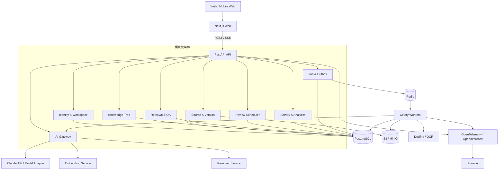
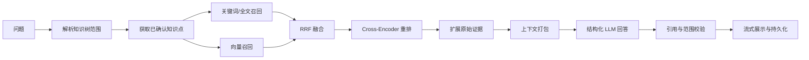

# 自序 · 个人知识管理工作台技术方案实现文档

> 文档类型：正式产品技术架构与实施方案  
> 方案版本：v1.0  
> 编制日期：2026-07-30  
> 需求基线：`自序-个人知识管理工作台-需求开发文档.md` v1.0  
> 交互基线：`index.html` 现有 Demo  
> 适用阶段：v0.1～v0.4，从单用户知识闭环演进到多空间、多工作台平台

---

## 1. 执行摘要

### 1.1 方案结论

“自序”不应被实现成一个简单的“文档聊天”应用，也不应把所有流程包装成开放式 Agent。产品真正有竞争力的核心是建立一条**证据优先、人工确认、引用可验证、可持续复习**的个人知识生产链：

> 原始资料是证据，AI 提炼是建议，人工确认形成知识，知识树负责组织，RAG 负责调用，间隔复习负责记忆，事件流负责反馈。

推荐的首期主架构为：

- **前端**：Next.js App Router + React + TypeScript + TanStack Query；
- **后端**：FastAPI + Pydantic + SQLAlchemy + Alembic，采用模块化单体；
- **业务数据库**：PostgreSQL，负责全部权威业务状态、版本、权限、事件与任务；
- **向量检索**：首期使用 PostgreSQL + pgvector，并结合中文分词后的全文检索；
- **对象存储**：S3 兼容存储，开发环境使用 MinIO；
- **后台任务**：Celery + Redis，配合 PostgreSQL Job/Outbox，而不是依赖 Celery Result Backend 保存业务事实；
- **文档解析**：Docling 为主要解析器，按格式配置 OCR 和降级解析；
- **AI 接入**：Python 官方模型 SDK，首期以 Claude 官方 SDK 和 `claude-opus-5` 为质量基线，模型调用封装在内部 AI Gateway 中；
- **AI 编排**：核心闭环使用确定性工作流和数据库状态机；LangGraph 只作为后续复杂 Agent 的升级路径；
- **RAG**：范围过滤 → 混合召回 → RRF 融合 → Cross-Encoder 重排 → 上下文组装 → 结构化生成 → 服务端引用校验；
- **Embedding / Reranker**：以 BGE-M3 + bge-reranker-v2-m3 作为中文/多语言可自托管基线，同时保留商业模型适配器；
- **复习算法**：v0.1 保持可解释简化调度，v0.3 切换到 Py-FSRS，并保存算法版本；
- **观测与评测**：OpenTelemetry/OpenInference + Phoenix；Ragas 或 DeepEval 用于离线 RAG 回归，但核心业务指标与引用校验由项目自身实现；
- **部署**：本地 Docker Compose，生产环境容器化部署；优先托管 PostgreSQL、对象存储与 Redis。

### 1.2 最重要的架构原则

1. **PostgreSQL 是业务事实源**：Agent checkpoint、队列状态、可观测平台都不能替代业务数据库。
2. **业务人审不等于 Agent HITL**：候选审核是可跨天、可审计的领域状态迁移，不应让内存中的 Agent 循环等待用户。
3. **正式知识与模型记忆分离**：已确认知识、来源证据、会话上下文和用户偏好是四类不同数据。
4. **先范围过滤再语义检索**：知识树范围必须在数据库层落实，不能只写进 Prompt。
5. **引用由后端验证，不由模型自证**：模型只能引用本次提供的稳定证据 ID，服务端检查存在性、范围、版本和引用文本。
6. **异步任务至少一次执行**：解析、Embedding、提炼任务均按可能重复执行设计，通过幂等键和唯一约束去重。
7. **先模块化单体，后按瓶颈拆分**：当前业务规模不需要微服务，但从第一天保留清晰模块边界和事件接缝。
8. **评测不是上线前一次测试**：解析、检索、生成、引用、复习调度分别建立可持续回归集和线上指标。

---

## 2. 需求与原型分析结论

### 2.1 产品闭环

需求文档和 HTML 原型已经形成一致的七步流程：

```text
导入知识
  → 保存来源及不可变版本
  → 解析结构和稳定锚点
  → AI 生成候选知识点
  → 人工审查
  → 正式知识树
  → 范围 RAG 问答 / 间隔复习
  → 学习事件和反馈
```

该闭环要求系统同时具备四种能力：

- **内容系统**：来源、版本、段落、知识点、关系和知识树；
- **AI 系统**：提炼、检索、重排、问答和可选的记忆提取；
- **学习系统**：复习卡、调度、反馈和学习记录；
- **平台系统**：身份、业务空间、工作台注册、权限和审计。

### 2.2 需求—原型—实现方式映射

| 能力 | 原型表现 | 正式实现方式 | AI/Agent 分类 |
|---|---|---|---|
| 今日学习 | 待审查、待复习、最近活动 | PostgreSQL 查询 + 任务排序规则 | 无需 LLM |
| 文件导入 | Mock 资料和模拟进度 | 预签名上传、SourceVersion、异步 Job | 确定性后台工作流 |
| 文档解析 | 固定章节和段落 | Docling/OCR、结构归一化、锚点生成 | 无需 Agent |
| AI 提炼 | 预置候选 | 结构化模型输出、Schema 校验、去重检查 | 单次/分批 LLM 工作流 |
| 人工审查 | 三栏审查和三种决策 | 数据库状态机 + 事务 | 业务 HITL，非 Agent interrupt |
| 知识树 | 内存树、搜索、详情 | PostgreSQL 邻接表 + `ltree` 路径 + 检索索引 | 无需 Agent |
| 知识问答 | Mock 范围回答 | 范围解析、混合 RAG、重排、结构化生成、引用校验 | 确定性 RAG 工作流 |
| 来源抽屉 | 固定段落定位 | 稳定 Evidence ID + 定位降级 | 无需 Agent |
| 间隔复习 | 简化四档规则 | ReviewCard + ReviewLog；后续 Py-FSRS | 算法服务，无需 LLM |
| 学习记录 | 内存事件流 | ActivityEvent + 聚合查询 | 无需 LLM |
| 工作台切换 | 知识工作台与 Coding 占位 | 工作台注册表和模块清单 | 平台能力 |
| 通用工具 | 当前无真实外部工具 | 内部 Tool Registry，后续可接 MCP | 仅在确有开放式任务时 Agent 化 |

### 2.3 从原型继承的关键交互约束

正式产品必须保留以下已经被 Demo 验证的设计：

- 搜索位于知识树内部，不恢复无明确需求的顶栏全局搜索；
- 原始来源、AI 候选、待验证候选和正式知识使用不同身份视觉；
- 提炼审查保持“队列 / 原文证据 / 可编辑候选”三栏心智模型；
- 问答前明确展示范围、知识点数、来源数和通用补充开关；
- AI 通用补充必须独立呈现，不能混入个人知识结论；
- 引用抽屉不打断当前任务，并支持焦点恢复；
- 只有已确认的原子知识点能够进入复习；
- 所有关键动作写入统一事件流；
- 知识树按 WAI-ARIA Tree 模式实现完整键盘交互。

### 2.4 对需求文档中待确认问题的技术默认决策

这些决策可支持首期开发，不阻塞当前方案：

1. **知识点允许关联多个来源和多个来源版本**：使用 `KnowledgeEvidence` 多对多关系。
2. **允许用户原创知识点**：`origin_type=user_authored`，来源可为空，但必须显示身份。
3. **知识文档允许独立正文**：正文可选；既可作为容器，也可承载主题说明。
4. **树与标签分工**：树表示主归属，标签表示跨主题维度；首期一个知识点只有一个树父节点。
5. **来源更新采用影响分析**：新版本完成后，异步标记关联知识点为 `review_recommended`，不自动覆盖知识。
6. **删除来源默认软删除**：历史引用继续指向冻结版本；物理删除需经过保留期和影响确认。
7. **复习算法**：v0.1 简化调度，v0.3 Py-FSRS；所有日志保存 `scheduler_version`。
8. **知识关系**：数据模型首期预留 `KnowledgeRelation`，UI 在 P1/P2 开放相关、前置、冲突关系。
9. **重复知识推荐**：首期只提示，不自动合并；合并必须人工确认并保留重定向关系。
10. **跨工作台搜索**：P0/P1 不做；有真实使用证据后再进入 P2。
11. **Coding 工作台共享知识**：通过明确授权的 Knowledge API 或 Tool 实现，不直接共享数据库表。
12. **部署形态**：先采用云端同步架构，同时保留本地 Docker Compose 和数据导出能力；纯本地优先作为后续产品模式，不在 P0 同时建设双同步系统。

---

## 3. 总体架构

### 3.1 逻辑架构图



### 3.2 部署单元

首期虽然采用模块化单体代码库，但部署为不同进程：

| 部署单元 | 职责 | 扩容方式 |
|---|---|---|
| `web` | Next.js 页面、BFF 辅助能力 | 按 HTTP 请求水平扩容 |
| `api` | FastAPI、鉴权、业务事务、SSE | 按 API 流量水平扩容 |
| `worker-io` | 抓取、文件 I/O、对象存储 | 高并发低 CPU |
| `worker-cpu` | 文档解析、OCR、分块 | 按 CPU/内存扩容 |
| `worker-llm` | 提炼、Embedding、批处理 | 按模型配额扩容 |
| `worker-maintenance` | Outbox、索引修复、清理、评测 | 低并发定时任务 |
| PostgreSQL | 权威业务数据和首期向量索引 | 托管服务、读副本、垂直扩容 |
| Redis | Celery Broker、短期缓存、限流 | 可重建状态，不存业务事实 |
| Object Storage | 原始文件、派生文件、导出包 | 生命周期管理和版本策略 |
| Phoenix | AI Trace、数据集和实验 | 初期单实例，后续独立数据库 |

### 3.3 为什么选择模块化单体而非微服务

当前领域关系高度一致：确认候选时需要在一个事务内创建知识点、证据关系、复习卡、活动事件和 Outbox。过早拆微服务会增加：

- 分布式事务和最终一致性复杂度；
- 本地开发成本；
- API 版本和部署编排成本；
- 调试一条知识链路所需的上下文切换。

模块化单体仍然通过领域包、Repository 接口和内部事件保持边界。只有出现以下瓶颈时再独立拆分：

- 文档解析需要独立弹性和 GPU/CPU 资源；
- 检索 QPS 与业务 API 差异明显；
- AI Gateway 需要统一服务多个工作台；
- 活动分析进入独立 OLAP 规模；
- 团队组织已经按服务长期负责。

---

## 4. 推荐技术栈与选型理由

### 4.1 前端

| 技术 | 用途 | 选择理由 |
|---|---|---|
| Next.js App Router | 页面框架和路由 | React 主流生产路径，支持服务端渲染、Suspense 和流式页面 |
| React + TypeScript | 组件和类型系统 | 与原型复杂交互、设计系统和可访问性适配良好 |
| TanStack Query | 服务器状态 | 缓存、失效、乐观更新、分页、请求取消清晰 |
| Zustand 或局部 Reducer | 纯页面交互状态 | 仅用于抽屉、选择、树展开、编辑草稿，不复制服务器状态 |
| React Hook Form + Zod | 表单和校验 | 候选编辑、设置、导入配置的类型安全 |
| React Aria Components 或同级 Headless 组件 | Dialog、Combobox、Focus 管理 | 满足原型的无障碍验收要求 |
| CSS Variables + CSS Modules/Tailwind 二选一 | 设计系统 | 延续 Demo 的档案馆视觉变量并支持主题化 |
| Vitest + Testing Library + Playwright | 测试 | 单元、组件、键盘和端到端交互覆盖 |

前端状态必须分层：

- **服务器事实**：TanStack Query；
- **当前页面 UI**：组件状态或 Zustand；
- **可恢复草稿**：后端 Draft 资源或 IndexedDB；
- **流式问答**：独立 SSE 客户端更新 Query Cache，不把完整会话塞入全局 Store。

### 4.2 后端

| 技术 | 用途 | 选择理由 |
|---|---|---|
| Python 3.12+ | AI 与后端主语言 | 生态成熟，适合 LangChain/LangGraph、解析和评测 |
| FastAPI | HTTP API 与 SSE | Pydantic 类型、OpenAPI、异步和流式能力成熟 |
| Pydantic v2 | API / AI Schema | 统一请求、结构化输出和配置校验 |
| SQLAlchemy 2 | ORM / SQL | 事务、关系和复杂查询能力成熟 |
| Alembic | 数据库迁移 | 版本化 Schema 变更 |
| Celery | 后台任务 | 适合当前解析、索引和批处理任务，团队认知成本低 |
| Redis | Broker / Cache / Rate Limit | 与 Celery 配合成熟；仅保存可丢失数据 |
| `uv` | Python 环境与锁文件 | 快速、可重复安装，适合 Monorepo/CI |
| pytest + Testcontainers | 后端测试 | 使用真实 PostgreSQL/Redis 验证事务和索引 |

### 4.3 数据与搜索

| 技术 | 用途 | 选择理由 |
|---|---|---|
| PostgreSQL | 业务事实源 | 强事务、JSONB、RLS、全文搜索、扩展生态 |
| `ltree` | 知识树路径 | 高效祖先/后代查询，邻接表仍保留父子关系 |
| pgvector | 首期向量检索 | 与业务范围过滤和版本元数据同库，减少系统数量 |
| PostgreSQL FTS + 应用层中文分词 | 关键词召回 | 支持标题、正文、路径和来源检索；中文需显式分词评测 |
| S3 / MinIO | 不可变来源文件 | 低成本、版本化、生命周期和预签名上传 |
| Qdrant（条件升级） | 大规模混合向量检索 | 支持 dense/sparse、多阶段查询、payload filter 和 rerank |

不建议 P0 直接引入 Elasticsearch/OpenSearch、Qdrant、图数据库和独立缓存集群的组合。首期通过 PostgreSQL 验证规模和质量，再按真实瓶颈升级。

### 4.4 AI 与 RAG

| 技术 | 用途 | 决策 |
|---|---|---|
| Claude 官方 Python SDK | 提炼和问答 | 主模型接入，避免兼容层丢失结构化输出、流式和缓存能力 |
| `claude-opus-5` | 首期质量基线 | 先建立正确性和评测基准；任何更换或分层路由须通过回归集 |
| Docling | PDF/Office/结构化解析 | 保留标题、表格、页面和结构信息，适合证据锚定 |
| BGE-M3 | 中文/多语言 Embedding 基线 | 支持多语言、长输入和 dense/sparse/multi-vector 思路 |
| bge-reranker-v2-m3 | Cross-Encoder 重排 | 中文/英文统一重排基线 |
| LangGraph | 复杂 Agent 升级路径 | P0/P1 不作为业务主状态机；只在复杂动态流程成立时引入 |
| LangMem | 可选用户记忆实验 | 仅处理用户偏好/交互经验，不承载正式知识 |
| MCP | 后续工作台工具互操作 | 通过受控 Tool Gateway 接入，不让浏览器直接持有外部凭据 |

### 4.5 观测与评测

推荐：

- OpenTelemetry 负责厂商中立的 Trace/Metric/Log；
- OpenInference 负责 LLM、Retriever、Tool 等语义；
- Phoenix 负责 Trace、数据集、实验和评测分析；
- Ragas 或 DeepEval 作为离线指标库；
- 项目自有数据库保存 prompt 版本、模型版本、retrieval config、引用校验结果和核心评测摘要。

若团队强依赖 LangGraph 托管调试，可改用 LangSmith；若 Prompt 管理和开源 LLMOps 平台成为重点，可评估 Langfuse。业务代码应统一通过内部 telemetry adapter 埋点，避免绑定单个平台。

---

## 5. 代码组织与模块边界

### 5.1 推荐 Monorepo

```text
apps/
  web/                         # Next.js

services/
  api/                         # FastAPI 入口
  worker/                      # Celery worker 入口

packages/
  web-ui/                      # 设计系统与可访问组件
  web-workbench-sdk/           # 工作台前端注册协议
  contracts/                   # OpenAPI 生成类型 / 共享 Schema

python/
  src/zixu/
    platform/                  # identity, workspace, auth, workbench
    sources/                   # source, version, section, parser
    knowledge/                 # tree, point, revision, evidence, relation
    extraction/                # extraction job/candidate/review
    retrieval/                 # query, hybrid retrieval, rerank, citation
    conversations/             # QA session, turn, stream
    reviews/                   # cards, scheduler, logs
    activities/                # event stream and projections
    jobs/                      # job, outbox, retries, progress
    ai/
      gateway/                 # provider adapter
      prompts/                 # versioned prompts
      schemas/                 # structured output models
      safety/                  # input/output policy
    observability/
    shared/
  tests/

evals/
  datasets/
  retrieval/
  extraction/
  generation/
  regression/

infra/
  compose/
  docker/
  terraform/
  monitoring/

docs/
  adr/                         # Architecture Decision Records
  api/
  operations/
```

### 5.2 分层约束

每个 Python 领域模块采用：

```text
api/            # Router、Request/Response，不写业务规则
application/    # Use Case、事务边界、命令和查询
domain/         # Entity、Value Object、状态机、领域规则
infrastructure/ # SQLAlchemy、对象存储、模型 SDK、队列适配器
```

Celery Task 和未来 Temporal Activity 只能调用 Application Service，不能承载核心业务逻辑。这样可在不重写领域逻辑的前提下更换编排引擎。

---

## 6. 领域数据模型

### 6.1 通用字段

所有业务根实体从第一天包含：

```text
id                UUIDv7 / UUID
workspace_id      UUID
created_by         UUID
created_at         timestamptz
updated_at         timestamptz
version            integer，乐观锁
status             明确枚举，禁止用多个布尔值拼状态
```

所有业务唯一约束均带 `workspace_id`。生产应用数据库角色不得使用 superuser、表 owner 或 `BYPASSRLS`。

### 6.2 核心实体

#### 平台与空间

- `users`
- `workbenches`
- `workbench_installations`
- `knowledge_spaces`
- `space_memberships`
- `user_preferences`

#### 来源与版本

- `sources`
  - 类型、标题、状态、当前版本 ID、软删除信息；
- `source_versions`
  - `source_id`、递增版本、对象存储 Key、SHA-256、MIME、Parser 版本、元数据；
- `source_sections`
  - 结构节点、纯文本、顺序、父段落、页码/标题/行号定位、内容 Hash；
- `retrieval_chunks`
  - section 关联、chunk 文本、token 数、embedding、检索元数据、索引版本；
- `source_parse_artifacts`
  - Docling JSON/Markdown、OCR 结果、缩略图等派生文件。

`source_versions` 一旦进入 `ready` 不允许原位覆盖。修复解析结果应创建新的 `parse_revision` 或重新解析记录，不能悄悄改变历史证据。

#### 知识树与证据

- `knowledge_nodes`
  - `parent_id`、`path ltree`、类型、标题、当前 Revision ID、排序；
- `knowledge_revisions`
  - 正文、标签快照、编辑原因、创建者、内容 Hash；
- `knowledge_evidence`
  - `knowledge_revision_id`、`source_version_id`、`section_id`、引用文本、关系类型；
- `knowledge_relations`
  - `related`、`prerequisite`、`conflicts_with`、`duplicates`、`supersedes`；
- `knowledge_tags` / `knowledge_node_tags`。

知识点编辑创建 Revision，而不是直接覆盖历史正文。知识树移动只修改父节点和路径，不破坏 Evidence 关系。

#### 提炼

- `extraction_jobs`
  - 来源版本、Prompt 版本、模型、配置、状态、统计；
- `extraction_candidates`
  - 标题、正文、标签、建议位置、置信度、待验证原因、状态；
- `candidate_evidence`
  - 候选与一个或多个来源 Section 的关系；
- `candidate_reviews`
  - 决策、编辑前后快照、审查者、时间、原因。

建议状态机：

```text
generated → pending_review → accepted
                           ↘ needs_verification
                           ↘ rejected
                           ↘ superseded
```

#### 问答与引用

- `qa_sessions`
- `qa_turns`
  - 问题、结构化回答、模型/Prompt/检索配置版本、Trace ID、状态；
- `qa_scopes`
  - Scope 节点、是否含子节点、范围快照；
- `qa_retrieval_hits`
  - 各阶段分数、排序、命中原因；
- `qa_citations`
  - claim ID、source/version/section/chunk、引用文本、验证状态；
- `model_runs`
  - provider、model、usage、latency、cache、request ID、错误分类。

#### 复习

- `review_cards`
- `review_logs`
- `review_scheduler_configs`

为 Py-FSRS 预留：

```text
state, step, stability, difficulty, due,
last_review, scheduled_days, elapsed_days,
reps, lapses, scheduler_version, parameters_version
```

#### 任务与事件

- `jobs`
- `job_attempts`
- `outbox_events`
- `activity_events`
- `audit_logs`

`ActivityEvent` 是用户学习活动；`AuditLog` 是安全与管理审计，两者不能混用。

### 6.3 知识树存储策略

使用“邻接表 + 物化路径”双结构：

- `parent_id` 支持简单事务和排序；
- `path ltree` 支持祖先、后代和范围查询；
- 移动子树时在事务内更新路径；
- 对大子树移动使用异步 Job 或加范围锁；
- `workspace_id + path` 建唯一约束；
- 删除采用软删除和 Tombstone，历史问答仍可解释。

不要首期采用图数据库。当前主查询是树范围、证据反查和少量关系边，PostgreSQL 足够。只有在关系推理、多跳发现和图算法成为核心功能后再评估 Neo4j/GraphRAG。

---

## 7. 文档导入、解析与索引

### 7.1 导入状态机

```text
draft
 → uploading
 → uploaded
 → parsing
 → parsed
 → indexing
 → extracting
 → review_ready
```

任一步骤都可进入 `failed`，并记录：

- `error_code`；
- 用户可读摘要；
- 是否可重试；
- 最后成功阶段；
- 尝试次数；
- 原始异常仅写受控日志。

### 7.2 上传流程

1. 前端请求创建 Source；
2. API 校验类型、大小、空间权限和配额；
3. API 返回一次性预签名上传 URL；
4. 浏览器直传对象存储；
5. 前端调用 complete，后端校验对象存在、大小和 Hash；
6. 数据库事务中创建不可变 SourceVersion、Job 和 Outbox；
7. Worker 扫描文件、解析并写入派生结果。

URL 导入应通过受限抓取服务执行：

- 仅允许 HTTP/HTTPS；
- DNS 和重定向后再次检查私网地址，防止 SSRF；
- 限制响应大小、超时、重定向次数；
- 保存抓取时间、最终 URL、响应头、正文快照和内容 Hash；
- 动态页面按需使用 Playwright，但默认优先静态抓取和正文提取。

### 7.3 Docling 解析策略

Docling 输出统一 `DoclingDocument`，再转换为项目内部 Canonical Document：

```text
CanonicalDocument
  blocks[]
    block_id
    parent_block_id
    type
    text
    heading_path
    page_no
    bbox
    order
    table_html / table_text
    provenance
```

建议保留三层内容：

1. 原始文件；
2. Docling 原生 JSON/Markdown 解析产物；
3. 项目规范化 Section/Chunk。

这样升级 Parser 或 Chunker 时可以重建索引，而不覆盖原始来源。

### 7.4 稳定锚点

Evidence Locator 至少包含：

```json
{
  "sourceId": "...",
  "sourceVersionId": "...",
  "sectionId": "...",
  "locatorType": "page_heading_paragraph",
  "page": 8,
  "headingPath": ["第三章", "引用模型"],
  "paragraphIndex": 3,
  "bbox": [0.12, 0.21, 0.88, 0.34],
  "quote": "...",
  "quoteHash": "sha256:..."
}
```

定位降级顺序：

1. Section ID + 页面坐标精确定位；
2. 页面/标题路径 + Quote Hash；
3. 在指定版本内搜索保存的引用文本；
4. 打开正确来源版本并展示冻结引用片段；
5. 标记锚点需修复，不静默指向新版本。

### 7.5 Chunk 策略

不要只做固定字符切分。推荐：

- 先按文档结构、标题、段落和表格边界进行层级切分；
- 再按 Embedding 模型 token 上限进行 Hybrid Chunking；
- 目标区间初始可设为 300～700 tokens，重叠 50～100 tokens；
- 每个 Chunk 保留 Section、标题路径、页码、来源版本和业务空间；
- 表格同时保存结构化表达和适合检索的线性化文本；
- Chunk 参数进入 `index_config_version`，通过评测调优，不作为永恒常量。

### 7.6 任务幂等

每个异步阶段使用稳定幂等键：

```text
(workspace_id, job_type, resource_id, input_version, config_version)
```

处理结果先写对象存储/数据库，最后通过 Compare-And-Set 更新 Job。重复消息只能复用已有结果或安全重跑，不能创建重复候选和重复知识点。

---

## 8. AI 提炼技术方案

### 8.1 为什么不是 Agent

提炼流程目标、输入、输出和失败条件都可以预先定义，属于确定性 AI 工作流：

```text
选择 Section 批次
 → 构建来源上下文
 → 结构化知识候选生成
 → Schema 校验
 → Evidence ID 校验
 → 原子性/重复度检查
 → 写入候选队列
```

让 Agent 自主选择工具和无限循环会增加成本、不可预测性和审计难度，却没有明显业务收益。

### 8.2 输入

- 来源版本和 Section；
- 标题路径、页码和上下文窗口；
- 用户建议目录；
- 目标目录已有知识点摘要；
- 原子化、限定条件和禁止无来源事实的规则；
- Pydantic 输出 Schema；
- Prompt 版本、模型配置和语言偏好。

### 8.3 结构化输出

建议 Schema：

```json
{
  "candidates": [
    {
      "title": "...",
      "body": "...",
      "tags": ["..."],
      "evidenceSectionIds": ["..."],
      "suggestedDestinationId": "...",
      "atomicity": "atomic|needs_split",
      "confidence": 0.0,
      "needsVerification": false,
      "verificationReason": null,
      "conditions": ["..."],
      "exceptions": ["..."]
    }
  ]
}
```

结构化输出只保证类型和 JSON 结构，不保证事实正确。服务端还必须验证：

- 每个 Evidence ID 属于本次来源版本；
- Body 中的事实可以在 Evidence 文本中找到支持；
- 目标目录在当前空间存在且允许写入；
- 候选与已有知识点不存在高相似重复；
- `confidence` 只作为排序参考，不能自动接受候选。

### 8.4 分批与上下文策略

- 按章节或语义 Section 分批，不整本文件一次性提炼；
- 每批附带文档级摘要和标题结构，但只允许引用本批可见 Evidence ID；
- 相邻批次完成后执行一次轻量跨批去重；
- 对长文档使用 Prompt Caching 的稳定前缀；
- 保存输入 Token、输出 Token、缓存命中、延迟和失败原因；
- 避免让模型生成数据库 ID，数据库 ID 由服务端创建。

### 8.5 人工确认事务

“确认加入知识树”必须在一个数据库事务内：

1. 锁定 Candidate 并检查仍为可审查状态；
2. 保存最终人工编辑快照；
3. 创建 KnowledgeNode 和 KnowledgeRevision；
4. 创建一个或多个 KnowledgeEvidence；
5. 创建 ReviewCard；
6. 更新 Candidate 为 `accepted`；
7. 创建 ActivityEvent；
8. 创建 Outbox Event；
9. 提交事务。

接口使用 Idempotency-Key。重复提交返回第一次成功结果。

---

## 9. 范围 RAG 问答方案

### 9.1 总流程



### 9.2 范围解析

前端只提交：

```json
{
  "scopeNodeId": "...",
  "includeDescendants": true,
  "allowGeneralSupplement": false
}
```

后端根据 `ltree` 和 Workspace 权限解析出允许检索的：

- KnowledgeNode ID 集合；
- SourceVersion ID 集合；
- Chunk ID 集合；
- 范围摘要和快照 Hash。

检索 SQL 或向量查询必须带该过滤条件。不能只把“请在某目录内回答”写进 Prompt。

### 9.3 两层语料

RAG 同时检索两层内容：

1. **已确认知识层**：权重更高，代表用户正式结论；
2. **原始证据层**：用于补充上下文和验证引用。

建议先检索知识点，再展开其 Evidence；同时允许原始来源 Chunk 直接召回，以发现尚未提炼但与问题相关的证据。两类命中必须携带不同 `content_identity`。

### 9.4 混合召回

首期：

- 标题、路径、标签和正文使用 PostgreSQL FTS；
- 中文文本在入库前使用可替换 Tokenizer 生成检索词；
- 使用 pgvector HNSW 做 Dense Retrieval；
- 每路召回 30～80 条候选；
- 使用 RRF 融合，不直接比较不同分数空间；
- 使用 bge-reranker-v2-m3 将候选重排到 8～15 条证据。

初始 RRF：

```text
score(d) = Σ 1 / (k + rank_i(d)), k 初始取 60
```

参数必须通过中文真实问题集评测，而不是凭经验固定。

### 9.5 Qdrant 升级门槛

出现以下情况时评估迁移向量索引：

- 单空间 Chunk 达到百万级，PostgreSQL 检索延迟或写入维护明显恶化；
- 需要原生 dense + sparse + ColBERT 多阶段查询；
- 向量服务需与业务数据库独立扩缩；
- 索引重建影响业务事务；
- 检索团队需要独立迭代和灰度多索引。

即使迁移到 Qdrant，PostgreSQL 仍保存 Chunk 元数据和权威范围；Qdrant Payload 保存 `workspace_id`、`source_version_id`、`scope_path` 等过滤字段，并用索引版本支持双写迁移。

### 9.6 上下文打包

- 先去重重叠 Chunk；
- 优先保留已确认知识和直接 Evidence；
- 保留标题路径、来源版本和 Evidence ID；
- 每个证据块使用不可伪造的服务端短 ID，例如 `E1`、`E2`；
- 为同一来源保留适量上下文，避免一个文档占满窗口；
- 达到 Token Budget 时按重排分数、身份权重和来源多样性裁剪；
- 记录最终实际送入模型的 Evidence 集合。

### 9.7 结构化回答

```json
{
  "scopeSummary": "...",
  "knowledgeClaims": [
    {
      "claimId": "C1",
      "text": "...",
      "evidenceIds": ["E1", "E3"]
    }
  ],
  "sourceSummaries": [
    {
      "text": "...",
      "evidenceIds": ["E2"]
    }
  ],
  "generalSupplements": [
    {
      "text": "...",
      "disclaimer": "当前个人知识库未直接支持"
    }
  ],
  "insufficientEvidence": false,
  "missingEvidence": []
}
```

如果 `allowGeneralSupplement=false`，`generalSupplements` 必须为空。模型输出后服务端执行引用验证：

- Evidence ID 是否在本次上下文；
- Evidence 是否属于当前范围和 Workspace；
- SourceVersion 是否仍存在；
- Claim 是否至少有一个有效引用；
- 引用文本 Hash 是否匹配；
- 无引用的事实性 Claim 降级为待复核或不展示。

### 9.8 流式协议

问答使用 SSE：

```text
event: turn.created
event: retrieval.started
event: retrieval.completed
event: answer.delta
event: citation.validated
event: answer.completed
event: error
```

建议先完成检索并保存 Retrieval Snapshot，再开始生成。流式文本只用于体验；最终结构化结果和引用验证完成后才将 Turn 标记为 `completed`。中途断线可通过 `Last-Event-ID` 或 Turn 查询接口恢复最终状态。

---

## 10. Agent、规划、工具与 LangGraph 使用边界

### 10.1 P0/P1 不做“万能 Agent”

核心功能均有明确状态和结果，不需要开放式规划：

- 解析：固定 Pipeline；
- 提炼：结构化模型步骤；
- 审查：业务状态机；
- RAG：可观测的检索生成工作流；
- 复习：确定性算法。

这能减少不可重复路径、Token 消耗、权限风险和线上调试困难。

### 10.2 适合后续 Agent 化的能力

P2 可增加“知识研究助手”，用于：

- 在多个来源中主动寻找冲突证据；
- 提出知识缺口并请求用户授权搜索；
- 推荐重复知识合并方案；
- 生成学习计划并调用日历/提醒工具；
- 在 Coding 工作台中检索知识并解释代码；
- 执行跨工作台但可审批的复杂任务。

这些任务具有动态分支、工具选择和多步推理，才符合 Agent 的投入条件。

### 10.3 LangGraph 采用条件

出现以下多个信号时引入 LangGraph：

- 动态循环和条件边大量增加；
- Agent 自主决定下一工具；
- 多 Agent / Subgraph 协作；
- 跨请求暂停恢复成为常态；
- 手写控制流难以理解；
- 需要图状态历史、Replay 或 Time Travel。

使用 LangGraph 后仍须遵守：

- Checkpoint 只保存执行状态，不保存正式知识事实；
- `thread_id` 与业务 Job ID 显式关联；
- `interrupt()` 前的副作用必须幂等；
- 审批后的写操作放在独立节点；
- PostgreSQL 业务表仍是权限、审核、引用和知识版本的权威来源；
- 设定 Checkpoint TTL、加密和删除策略。

### 10.4 工具系统

内部 Tool Registry 为每个工具声明：

```text
name, version, input_schema, output_schema,
required_scopes, risk_level, timeout,
idempotency_policy, approval_policy,
data_classification, audit_policy
```

风险等级：

- `read_only`：知识检索、范围统计；
- `write_reversible`：创建草稿、标签建议；
- `write_sensitive`：接受知识、删除来源、外部发布；
- `external_side_effect`：发送消息、日历、Git 操作。

后两类必须经过明确审批。模型不能直接持有数据库、对象存储或第三方长期凭据。

### 10.5 MCP

MCP 适合作为未来工作台和外部工具的标准连接层，但不应成为内部领域 API 的唯一协议。推荐：

- 内部核心服务使用类型化 Application API；
- 通过 MCP Gateway 暴露受控工具；
- Host 负责用户同意、权限、上下文隔离和审计；
- HTTP MCP 按 OAuth 2.1 相关规范做授权；
- 禁止 Token Passthrough；
- 外部工具输出视为不可信输入；
- Tool Annotation 不能作为安全决策的唯一依据。

---

## 11. 记忆系统设计

### 11.1 四类“记忆”必须分开

| 类型 | 示例 | 存储 | 注入策略 |
|---|---|---|---|
| 正式知识 | 已确认知识点和来源 | Knowledge/Evidence 表 | 按范围 RAG 检索 |
| 会话短期状态 | 当前问答历史、范围 | QA 表；短期缓存 | 当前会话窗口/摘要 |
| 用户长期偏好 | 回答长度、语言、关注主题 | UserMemory/Profile | 显式选择、相关性检索 |
| 程序性知识 | Prompt、规则、工具策略 | Git + Prompt Registry | 按版本加载 |

活动事件和历史问答属于“可供分析的经历”，不应默认全部注入每次 Prompt。

### 11.2 短期会话记忆

- 每个 QA Session 保存 Turn；
- 窗口内保留最近若干 Turn；
- 超过预算后生成带版本的 Conversation Summary；
- 检索问题改写可以使用摘要，但原始用户问题必须保留；
- 切换知识范围时明确记录 Scope 变化，不能沿用旧范围 Evidence；
- 用户删除会话时同步删除摘要和可观测平台中的关联敏感内容。

### 11.3 长期用户记忆

首期只支持高价值、低风险、可解释偏好，例如：

- 默认是否允许 AI 通用补充；
- 常用知识空间；
- 回答风格；
- 用户明确设定的学习目标。

每条长期记忆包含：

```text
memory_type, value, source_turn_id,
confidence, status, created_at, last_used_at,
expires_at, user_visible, user_editable
```

写入策略：

- 用户显式设置可直接写；
- 模型推断只能生成 Candidate；
- 敏感信息默认不自动记忆；
- 用户可查看、修改、删除；
- 冲突时以显式设置优先；
- 低价值、长期未使用或过期记忆可淘汰。

LangMem 可在后续用于记忆提取和整合实验，但 Memory Store 不是 Knowledge Base，也不能绕过人工确认把模型推断变成正式知识。

### 11.4 不建议的做法

- 把所有聊天记录做 Embedding 后无差别召回；
- 把正式知识点复制到“Agent Memory”形成双事实源；
- 允许 Agent 静默修改长期偏好；
- 把 LangGraph Checkpoint 当长期记忆；
- 将最近活动、复习日志全部塞进系统 Prompt。

---

## 12. 间隔复习方案

### 12.1 v0.1

复刻需求文档的透明四档规则，但实现为独立 Scheduler 接口：

```python
class ReviewScheduler(Protocol):
    def schedule(self, card, grade, now) -> ScheduleResult: ...
```

所有结果记录：

- Previous State；
- Grade；
- New State；
- Scheduler Name/Version；
- Parameters Version；
- 计算时间。

### 12.2 v0.3 Py-FSRS

迁移步骤：

1. 引入 Py-FSRS 作为 `fsrs-v6` Scheduler；
2. 对新卡直接使用 FSRS；
3. 对旧卡通过历史 ReviewLog 初始化状态；
4. 提供对照实验，不一次性改变全部用户队列；
5. 展示“为什么此时复习”的简明解释；
6. 参数优化必须有足够真实历史，缺少数据时使用稳定默认参数；
7. 保留一键回滚到上一 Scheduler Version 的能力。

复习卡问题和答案首期由提炼候选生成并随人工确认进入系统。后续可以允许用户编辑卡面或为一个知识点生成多种卡型，但不能让卡面脱离正式知识 Revision。

---

## 13. API 设计

### 13.1 API 规范

- 前缀：`/api/v1`；
- JSON 使用 camelCase 或 snake_case 统一一种，前后端生成类型；
- 所有写接口支持 `Idempotency-Key`；
- 错误使用稳定 `errorCode`，同时返回用户可读信息和 `requestId`；
- 列表使用 Cursor Pagination；
- ETag/Version 用于候选和知识编辑的乐观并发；
- 长任务返回 `202 Accepted + jobId`；
- SSE 使用独立 Job/Turn Stream；
- OpenAPI 生成 TypeScript Client，避免手写重复 DTO。

### 13.2 主要端点

#### 空间和树

```text
GET    /spaces
POST   /spaces
GET    /spaces/{spaceId}
GET    /spaces/{spaceId}/tree
POST   /spaces/{spaceId}/nodes
PATCH  /nodes/{nodeId}
POST   /nodes/{nodeId}/move
DELETE /nodes/{nodeId}
GET    /spaces/{spaceId}/search
```

#### 来源

```text
POST   /spaces/{spaceId}/sources
POST   /sources/{sourceId}/upload-url
POST   /sources/{sourceId}/versions/{versionId}/complete
POST   /spaces/{spaceId}/web-sources
GET    /sources/{sourceId}
GET    /sources/{sourceId}/versions
GET    /source-versions/{versionId}/sections
POST   /source-versions/{versionId}/reparse
DELETE /sources/{sourceId}
```

#### 提炼和审查

```text
POST   /source-versions/{versionId}/extractions
GET    /spaces/{spaceId}/candidates?status=
GET    /candidates/{candidateId}
PATCH  /candidates/{candidateId}
POST   /candidates/{candidateId}/accept
POST   /candidates/{candidateId}/mark-unverified
POST   /candidates/{candidateId}/reject
```

#### 问答

```text
POST   /spaces/{spaceId}/qa/scope-preview
POST   /spaces/{spaceId}/qa/sessions
POST   /qa/sessions/{sessionId}/turns
GET    /qa/turns/{turnId}
GET    /qa/turns/{turnId}/events
GET    /qa/citations/{citationId}
DELETE /qa/sessions/{sessionId}
```

#### 复习和记录

```text
GET    /spaces/{spaceId}/reviews/due
POST   /review-cards/{cardId}/reveal
POST   /review-cards/{cardId}/grade
GET    /review-cards/{cardId}/logs
GET    /spaces/{spaceId}/activities
GET    /spaces/{spaceId}/learning-summary
```

#### Job

```text
GET    /jobs/{jobId}
GET    /jobs/{jobId}/events
POST   /jobs/{jobId}/retry
POST   /jobs/{jobId}/cancel
```

### 13.3 Outbox

任何“业务写入后必须触发后台动作”的事务都写 Outbox：

```text
业务事务：SourceVersion ready + Job + OutboxEvent
提交后：Outbox Relay → Celery
Worker：幂等执行 → 写结果 → Job completed
```

禁止将 `db.commit(); task.delay()` 作为唯一投递保证。

---

## 14. 安全、隐私与可靠性

### 14.1 身份和空间隔离

- 使用成熟 OIDC/OAuth 身份服务或可替换 Auth 模块；
- API 根据 Token 得到 User，再解析 Workspace Membership；
- Repository 方法必须显式传入 `workspace_id`；
- 敏感表启用 PostgreSQL RLS 作为纵深防御；
- 对象存储 Key 使用 `workspace_id/source_id/version_id` 命名空间；
- 预签名 URL 短时有效，绑定操作和对象；
- Redis Key 带 Workspace 前缀，但不能仅靠 Key 命名实现权限。

### 14.2 文件安全

- MIME、扩展名和 Magic Number 交叉校验；
- 文件大小、页数、解压大小和解析时间限制；
- 压缩炸弹、恶意 PDF 和宏文件检测；
- 解析 Worker 运行在低权限、隔离容器；
- 禁止解析器访问不必要网络和宿主文件系统；
- 文件进入对象存储后先标记 `quarantined`，扫描通过再解析。

### 14.3 Prompt Injection 与 RAG 安全

导入文档属于不可信数据。必须：

- 在 Prompt 中明确来源内容不是系统指令；
- 不允许来源文本直接改变工具权限；
- 工具选择和授权在服务端执行；
- 来源内容与系统指令使用明确边界；
- 外部 URL、MCP Tool 结果和模型输出均做 Schema/HTML 安全处理；
- 对高风险工具设置审批和 Allowlist；
- 将“文档要求泄露系统提示词”等内容视为普通证据文本。

### 14.4 数据隐私

- 默认私有，模型调用前明确数据路径和供应商保留策略；
- API Key 只在服务器 Secret Manager；
- Trace 默认不记录完整原文，使用采样、脱敏或 Evidence ID；
- 用户可删除来源、知识、问答和长期记忆；
- 删除流程覆盖 PostgreSQL、对象存储、向量索引、缓存和可观测平台；
- 备份存在保留窗口时向用户明确说明；
- 敏感字段静态加密，传输统一 TLS；
- AuditLog 记录删除、导出、权限变更和敏感工具调用。

### 14.5 可靠性

- 外部 I/O 均设置连接、读取和总超时；
- 429/可恢复 5xx 指数退避加 Jitter；
- 参数错误和权限错误不盲目重试；
- Worker 长任务写 Heartbeat 和阶段进度；
- 使用数据库唯一约束做最终去重；
- Redis Lock 只能优化竞争，不能提供最终一致性；
- 定期执行悬挂 Job、孤立对象和缺失索引修复任务；
- 恢复演练覆盖 PostgreSQL、对象存储和索引重建。

---

## 15. 可观测性与评测体系

### 15.1 Trace 结构

每次导入、提炼或问答生成统一 Trace：

```text
request/job/turn
  ├─ auth_and_scope
  ├─ parse/chunk
  ├─ embed
  ├─ lexical_retrieval
  ├─ vector_retrieval
  ├─ fusion
  ├─ rerank
  ├─ context_build
  ├─ llm_generation
  ├─ citation_validation
  └─ persistence
```

Span 属性至少包括：

- `request_id`、`trace_id`、`job_id`、`turn_id`；
- 经过脱敏或 Hash 的 `workspace_id`；
- Model/Prompt/Parser/Index/Retrieval Config Version；
- Token、缓存命中、延迟和成本；
- 召回数量、重排数量、证据数量；
- 引用通过/失败数量；
- 错误类别和重试次数。

### 15.2 提炼评测

建立人工标注的来源—候选数据集，指标包括：

- Evidence Coverage；
- 事实支持率；
- 原子性；
- 条件/例外保留率；
- 重复候选率；
- Schema 成功率；
- 人工接受/编辑/拒绝率；
- 每个被接受知识点的 Token 和时间成本。

### 15.3 检索评测

数据集包含：问题、范围、相关知识点、相关 Evidence 和困难负例。指标：

- Recall@K；
- MRR；
- nDCG@K；
- Context Precision；
- 范围越界率必须接近 0；
- Source Version 正确率；
- 中文关键词、语义改写、同义表达分别统计。

### 15.4 生成与引用评测

- Faithfulness / Groundedness；
- Answer Relevance；
- Claim Citation Coverage；
- Citation Validity；
- Citation Entailment；
- Unsupported Claim Rate；
- 通用补充错误混入率；
- 无证据时正确拒答率；
- P95 首 Token 和完整回答延迟。

Ragas/DeepEval 的 LLM Judge 结果只能作为信号，关键引用存在性和范围合法性使用确定性代码验证。

### 15.5 在线反馈

产品内提供低打扰反馈：

- 回答有帮助/无帮助；
- 某条引用不支持结论；
- 候选过宽、遗漏条件、重复；
- 搜索结果无关；
- 复习卡问题质量。

反馈关联完整版本信息并进入评测数据候选池。加入正式回归集前由人工清洗，避免把噪声直接作为真值。

### 15.6 CI 质量门禁

每次修改 Prompt、Embedding、Chunk、Reranker 或检索参数时运行版本化回归：

- Schema 成功率不得下降；
- 范围越界和无效引用不得增加；
- Retrieval Recall@K 不得低于阈值；
- Faithfulness 达到阈值；
- 延迟和 Token 成本变化可见；
- 生成结果使用统计容忍区间，不追求逐字一致。

---

## 16. 性能与容量规划

### 16.1 初始目标

| 指标 | 初始目标 |
|---|---|
| 普通 API P95 | < 400ms，不含异步任务 |
| 知识树首屏 P95 | < 800ms |
| 树内关键词搜索 P95 | < 500ms |
| 范围检索 + 重排 P95 | < 1.5s |
| 问答首 Token P95 | < 3s，受外部模型影响 |
| Job 状态可见延迟 | < 2s |
| 引用范围越界率 | 0 |
| SourceVersion 覆盖写入 | 0 |

这些是工程目标，不是当前 Demo 已达成的 SLA，应在真实部署后校准。

### 16.2 大知识树

- 树接口按节点懒加载或分段返回；
- 前端只渲染可见节点，使用虚拟列表；
- 路径和计数使用缓存 Projection，但以数据库为准；
- 搜索独立查询，不在浏览器遍历完整树；
- 来源全文按章节加载；
- 搜索输入 150～250ms 防抖并支持 AbortSignal。

### 16.3 缓存

可缓存：

- 空间配置；
- 知识树浅层结构；
- Scope Summary；
- Embedding 结果（按内容 Hash + 模型版本）；
- 稳定 Prompt 前缀；
- 公开模型元数据。

不依赖缓存保证：

- 审查状态；
- 权限；
- Job 最终状态；
- 复习反馈；
- 引用合法性。

---

## 17. 测试策略

### 17.1 测试金字塔

- **Domain Unit**：状态机、范围解析、FSRS Adapter、引用校验；
- **Application Integration**：确认候选事务、Outbox、幂等和权限；
- **Repository Integration**：PostgreSQL、RLS、`ltree`、pgvector、并发；
- **Contract**：OpenAPI、模型 Structured Output Schema、SSE Event；
- **Worker**：重复投递、超时、失败恢复、Heartbeat；
- **Frontend Component**：Tree Keyboard、Dialog Focus、表单草稿；
- **E2E**：真实导入→提炼→审查→问答→引用→复习→记录；
- **AI Eval**：固定数据集的检索和生成回归；
- **Security**：跨空间访问、恶意文件、SSRF、Prompt Injection、XSS。

### 17.2 必测故障场景

1. 文件上传完成但 Outbox 尚未发布时 API 崩溃；
2. Worker 完成模型调用后写库失败并重试；
3. 用户重复点击“确认加入知识树”；
4. 审查期间目标文档被删除；
5. 来源产生新版本但旧知识仍引用旧版本；
6. 向量命中包含其他 Workspace 数据；
7. 模型返回不存在的 Evidence ID；
8. SSE 中断后刷新页面；
9. 删除来源时存在历史问答引用；
10. “忘记了”的复习卡在本轮重新出现；
11. HTML/脚本进入候选标题或正文；
12. MCP/网页内容包含恶意指令。

---

## 18. 开发与部署

### 18.1 本地开发

Docker Compose 提供：

```text
postgres + pgvector + ltree
redis
minio
api
worker
web
phoenix（可选 profile）
```

AI Key 通过本地 Secret/环境变量注入，不提交仓库。支持 Fake AI Adapter，使业务 E2E 不依赖外部模型。

### 18.2 生产环境

优先采用：

- 托管 PostgreSQL，开启 PITR；
- 托管 S3 兼容对象存储并设置生命周期；
- 托管 Redis 或可靠 Broker；
- Web/API/Worker 容器独立部署；
- Secret Manager；
- CDN 只用于静态资源，SSE 路径关闭代理缓冲；
- 数据库迁移采用 Expand → Deploy → Backfill → Contract；
- Worker 发布需考虑旧任务兼容和队列排空。

### 18.3 CI/CD

流水线：

```text
lint/typecheck
 → unit tests
 → integration tests with containers
 → frontend component/E2E
 → schema compatibility
 → AI eval smoke set
 → build images + SBOM + vulnerability scan
 → deploy staging
 → migration check
 → smoke test
 → progressive production rollout
```

Prompt 和 Retrieval Config 也需要版本、评审、回滚和变更记录。

---

## 19. 分阶段实施路线图

### Phase 0：工程基座（1～2 周）

- Monorepo、代码规范和 CI；
- Next.js / FastAPI 基础壳层；
- PostgreSQL、Redis、MinIO；
- 用户、Workspace、RLS 基础；
- Job、Outbox、ActivityEvent；
- OpenTelemetry 和错误规范；
- 将现有 HTML 视觉拆为设计 Token 和组件清单。

**验收**：可登录、切换空间、创建 Job、查看进度；基础 Trace 可见。

### Phase 1：v0.1 可用知识闭环（6～9 周）

- 真实文件/网页导入；
- Source/Version/Section 和 Docling 解析；
- AI 结构化提炼；
- 三栏人工审查；
- 持久化知识树和树内搜索；
- 来源抽屉和稳定锚点；
- 简化复习队列；
- 统一活动事件；
- 提炼与引用基础评测集。

**验收**：一份真实 PDF 能完成“导入→审查→知识点→来源→复习”的闭环，重复请求不产生重复对象。

### Phase 2：v0.2 可信 RAG（4～6 周）

- pgvector 和混合检索；
- 中文检索评测；
- BGE-M3 / Reranker 服务；
- 四级范围过滤；
- 结构化回答身份；
- 服务端引用校验；
- SSE 和问答历史；
- Phoenix 数据集与 CI 回归。

**验收**：范围越界率为 0；引用可定位；无证据时正确拒答；Prompt/模型/索引版本完整可追踪。

### Phase 3：v0.3 长期学习（3～5 周）

- Py-FSRS Adapter；
- Review History 和调度解释；
- 学习计划和提醒；
- 复习质量反馈；
- 来源版本影响分析；
- 用户可控偏好记忆。

**验收**：调度版本可迁移、可回滚；复习数据与知识 Revision 稳定关联。

### Phase 4：v0.4 平台化与 Agent 增强（按需求）

- 工作台注册 SDK；
- Coding 工作台基础版；
- Tool Registry 和 MCP Gateway；
- 知识冲突/缺口研究 Agent；
- 复杂流程满足门槛时引入 LangGraph；
- 多空间和导入导出增强；
- 评估本地优先/端云同步。

**验收**：新工作台无需修改平台核心导航逻辑即可注册；跨工作台工具调用经过授权与审计。

---

## 20. 主要风险与缓解措施

| 风险 | 后果 | 缓解 |
|---|---|---|
| 过早 Agent 化 | 成本、延迟和调试复杂度上升 | 核心链路采用确定性工作流 |
| 模型结构正确但事实错误 | 错误知识候选 | Evidence 校验 + 人工确认 + Eval |
| 中文全文检索质量不足 | 关键词召回差 | 显式分词、混合检索、真实数据集评测；必要时升级 Qdrant/OpenSearch |
| 来源更新破坏引用 | 知识失去可追溯性 | 不可变版本、旧引用冻结、影响分析 |
| Celery 重复执行 | 重复候选/重复写入 | 幂等键、唯一约束、Job/Outbox |
| 可观测平台泄露原文 | 隐私风险 | 脱敏、采样、Evidence ID、保留策略 |
| 单库向量规模增长 | 检索和维护性能下降 | 监控阈值、索引版本、Qdrant 双写迁移路径 |
| Prompt Injection | 工具越权或信息泄露 | 文档不可信边界、服务端授权、审批、工具隔离 |
| 多空间逻辑遗漏 | 数据越权 | Repository Scope + RLS + 跨租户测试 |
| FSRS 切换影响队列 | 用户体验波动 | Adapter、版本字段、灰度和回滚 |
| 框架锁定 | 升级和迁移成本 | Application Service、Provider/Telemetry/Tool Adapter |

---

## 21. 产品竞争力设计

### 21.1 与普通“文档聊天”产品的差异

1. **知识生产而非一次性聊天**：AI 候选经人工确认后成为长期资产。
2. **证据级可追溯**：来源版本、段落锚点、引用文本和降级定位完整保存。
3. **内容身份分区**：个人知识、来源归纳和通用补充不会混淆。
4. **范围是真实权限和检索条件**：不是 Prompt 中的口头约束。
5. **知识能被长期复习**：RAG 使用和记忆训练形成闭环。
6. **版本影响分析**：来源更新后识别可能过时知识，而不是静默覆盖。
7. **可评测 AI**：Prompt、模型、索引、引用质量可回归和比较。
8. **隐私和互操作**：支持自托管组件、导出和 MCP 扩展路径。

### 21.2 建议优先打磨的市场亮点

- “每条知识都能回到当时的原文版本”；
- “AI 只能建议，用户决定什么进入知识库”；
- “问答范围可视、引用可点、无证据不伪造”；
- “确认一次，后续可检索、问答、复习和追踪”；
- “资料变化时告诉用户哪些知识可能需要重审”；
- “支持本地开发部署和结构化数据导出”。

不要以“多 Agent 数量”作为卖点。市场价值来自可信闭环、使用体验和质量数据，而不是架构名词堆砌。

---

## 22. 面试与作品集竞争力

完成本方案后，项目可系统展示 AI 应用工程师的以下能力：

### 22.1 建议演示主线

1. 导入一份真实复杂 PDF；
2. 展示 Docling 结构、页码和稳定 Evidence；
3. 展示模型结构化提炼和人工编辑；
4. 确认后以一个事务生成知识、证据、复习卡和事件；
5. 在文件夹/文档/知识点不同范围提问；
6. 展示混合召回、RRF、重排和引用校验 Trace；
7. 故意制造无效引用，展示服务端拒绝；
8. 完成一次复习并解释 Scheduler Version；
9. 修改 Prompt 或 Chunk 配置，运行 Eval 对比；
10. 展示重复任务、断线恢复和跨空间访问测试。

### 22.2 面试中应能解释的 Trade-off

- 为什么核心流程不用全自主 Agent；
- LangGraph Checkpoint 与业务数据库的区别；
- 为什么人审是领域状态而不是一个暂停中的 Agent；
- 为什么首期用 pgvector，何时迁移 Qdrant；
- 如何实现范围过滤和引用真实性；
- 结构化输出能保证什么、不能保证什么；
- Celery 至少一次语义下如何幂等；
- Outbox 解决了什么故障窗口；
- 正式知识、对话记忆和用户偏好的区别；
- 如何设计 RAG Eval 和线上反馈闭环；
- 如何处理来源版本更新和删除；
- 如何从模块化单体演进，而不是一开始堆微服务。

### 22.3 建议作品集产物

- 架构图和 5～8 个 ADR；
- OpenAPI 文档；
- 数据模型 ERD；
- RAG Pipeline Trace 截图；
- Eval Dashboard 和一次真实迭代对比；
- 引用校验和范围隔离测试；
- 故障注入报告；
- 性能压测报告；
- 安全威胁模型；
- 3～5 分钟端到端演示视频；
- README 中的本地一键启动和设计取舍说明。

---

## 23. 建议建立的 ADR

1. ADR-001：采用模块化单体而非微服务；
2. ADR-002：PostgreSQL 为业务事实源；
3. ADR-003：首期使用确定性工作流而非 LangGraph 主状态机；
4. ADR-004：采用不可变 SourceVersion 和稳定 Evidence；
5. ADR-005：首期 PostgreSQL FTS + pgvector，保留 Qdrant 迁移路径；
6. ADR-006：业务人审使用数据库状态机；
7. ADR-007：Job + Transactional Outbox + Celery；
8. ADR-008：OpenTelemetry/OpenInference + Phoenix；
9. ADR-009：正式知识、会话状态和长期用户记忆分离；
10. ADR-010：复习算法通过 Versioned Scheduler Adapter 接入。

---

## 24. 市场调研依据与官方资料

以下资料用于验证本方案中的主流能力和成熟实现路径；正式实施时应锁定依赖版本并再次检查兼容性。

### 24.1 LangGraph、工作流和模型接入

- [LangGraph Overview](https://docs.langchain.com/oss/python/langgraph/overview)
- [LangGraph Persistence](https://docs.langchain.com/oss/python/langgraph/persistence)
- [LangGraph Interrupts](https://docs.langchain.com/oss/python/langgraph/interrupts)
- [LangGraph Durable Execution](https://docs.langchain.com/oss/python/langgraph/durable-execution)
- [LangChain Structured Output](https://docs.langchain.com/oss/python/langchain/structured-output)
- [LlamaIndex Human in the Loop](https://developers.llamaindex.ai/python/llamaagents/workflows/human_in_the_loop/)
- [LlamaIndex Durable Workflows](https://developers.llamaindex.ai/python/llamaagents/workflows/durable_workflows/)
- [LlamaIndex DBOS Durable Execution](https://developers.llamaindex.ai/python/llamaagents/workflows/dbos/)
- [Anthropic Python SDK](https://github.com/anthropics/anthropic-sdk-python)
- [Claude Tool Use](https://platform.claude.com/docs/en/agents-and-tools/tool-use/overview.md)
- [Claude Structured Outputs](https://platform.claude.com/docs/en/build-with-claude/structured-outputs.md)
- [Claude Streaming](https://platform.claude.com/docs/en/build-with-claude/streaming.md)

### 24.2 文档解析与检索

- [Docling Architecture](https://docling-project.github.io/docling/concepts/architecture/)
- [Docling Document Converter](https://docling-project.github.io/docling/reference/document_converter/)
- [Docling Chunking](https://docling-project.github.io/docling/concepts/chunking/)
- [pgvector 官方仓库及 Hybrid Search 建议](https://github.com/pgvector/pgvector)
- [PostgreSQL Full Text Search](https://www.postgresql.org/docs/current/textsearch.html)
- [Qdrant Hybrid and Multi-Stage Queries](https://qdrant.tech/documentation/search/hybrid-queries/)
- [Qdrant Hybrid Search with Reranking](https://qdrant.tech/documentation/advanced-tutorials/reranking-hybrid-search/)
- [Qdrant Filtering](https://qdrant.tech/documentation/search/filtering/)
- [BGE-M3 Model Card](https://huggingface.co/BAAI/bge-m3)
- [bge-reranker-v2-m3 Model Card](https://huggingface.co/BAAI/bge-reranker-v2-m3)

### 24.3 后台任务与持久执行

- [Celery Tasks、重试和幂等](https://docs.celeryq.dev/en/stable/userguide/tasks.html)
- [Celery Canvas](https://docs.celeryq.dev/en/stable/userguide/canvas.html)
- [Temporal Python SDK](https://docs.temporal.io/develop/python)
- [Temporal Workflow Basics](https://docs.temporal.io/develop/python/workflows/basics)
- [Temporal Activity Basics](https://docs.temporal.io/develop/python/activities/basics)

### 24.4 Web、数据与安全

- [Next.js App Router](https://nextjs.org/docs/app)
- [Next.js Production Checklist](https://nextjs.org/docs/app/guides/production-checklist)
- [FastAPI Server-Sent Events](https://fastapi.tiangolo.com/tutorial/server-sent-events/)
- [TanStack Query Advanced Server Rendering](https://tanstack.com/query/latest/docs/framework/react/guides/advanced-ssr)
- [PostgreSQL Row Security Policies](https://www.postgresql.org/docs/current/ddl-rowsecurity.html)
- [Redis Persistence](https://redis.io/docs/latest/operate/oss_and_stack/management/persistence/)
- [MCP 2026-07-28 Specification](https://modelcontextprotocol.io/specification/2026-07-28)
- [MCP Architecture](https://modelcontextprotocol.io/specification/2026-07-28/architecture)
- [MCP Tools](https://modelcontextprotocol.io/specification/2026-07-28/server/tools)
- [MCP Security Best Practices](https://modelcontextprotocol.io/docs/tutorials/security/security_best_practices)

### 24.5 记忆、复习和评测

- [LangMem](https://langchain-ai.github.io/langmem/)
- [LangMem Conceptual Guide](https://langchain-ai.github.io/langmem/concepts/conceptual_guide/)
- [LangChain Long-term Memory](https://docs.langchain.com/oss/python/langchain/long-term-memory)
- [Py-FSRS](https://github.com/open-spaced-repetition/py-fsrs)
- [FSRS Algorithm Guide](https://github.com/open-spaced-repetition/awesome-fsrs/wiki/ABC-of-FSRS)
- [Phoenix Overview](https://arize.com/docs/phoenix)
- [Phoenix Tracing](https://arize.com/docs/phoenix/tracing/concepts-tracing/how-does-tracing-work)
- [Phoenix Datasets and Experiments](https://arize.com/docs/phoenix/datasets-and-experiments/how-to-experiments)
- [LangSmith Evaluation](https://docs.langchain.com/langsmith/evaluation)
- [Langfuse Observability](https://langfuse.com/docs/observability/overview)
- [Langfuse Evaluation Experiments](https://langfuse.com/docs/evaluation/experiments/experiments-via-sdk)
- [Ragas Available Metrics](https://docs.ragas.io/en/stable/concepts/metrics/available_metrics/)
- [Ragas Faithfulness](https://docs.ragas.io/en/stable/concepts/metrics/available_metrics/faithfulness/)
- [DeepEval RAG Evaluation](https://deepeval.com/guides/guides-rag-evaluation)
- [OpenTelemetry GenAI Observability](https://opentelemetry.io/blog/2026/genai-observability/)

---

## 25. 最终建议

本项目的首要成功条件不是一次性接入最多的 AI 框架，而是把以下四件事做到可靠：

1. **任何正式知识都能追溯到正确的来源版本和证据位置；**
2. **任何 AI 候选都必须经过清晰、低成本的人工作业流；**
3. **任何知识问答都在数据库落实的范围内检索，并由服务端验证引用；**
4. **任何已确认知识都能持续进入检索、复习和学习反馈闭环。**

因此，建议先以 FastAPI + PostgreSQL + Celery + Docling + pgvector + Claude 官方 SDK 建成可观测、可评测的模块化单体，再根据真实复杂度引入 Qdrant、LangGraph、Temporal 或更完整的多工作台 Agent 系统。

这条路线既能形成具有市场差异化的“可信个人知识工作台”，也能作为 AI 应用工程师作品集完整展示：RAG、Agent 边界、HITL、记忆、工具、异步任务、引用校验、评测、可观测性、安全和生产架构能力。
