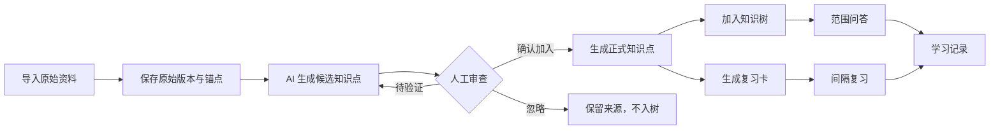

# 自序 · 个人知识管理工作台需求与开发文档

> 文档类型：产品需求文档（PRD）+ Demo 开发规格  
> 当前版本：v1.0  
> 文档状态：基于现有 Demo 梳理  
> 产品形态：个人专属多工作台平台中的知识管理工作台  
> 当前原型入口：`index.html`

---

## 1. 文档目的

本文档用于统一当前 Demo 的产品定位、功能范围、业务流程、数据模型、交互规则和开发验收标准，作为后续产品设计、前端开发、后端开发、AI 能力接入和测试工作的共同依据。

本文档重点回答以下问题：

1. “自序”平台解决什么问题？
2. “知识管理工作台”包含哪些明确功能？
3. 一份资料如何转化为可问答、可复习的知识？
4. 原始资料、AI 提炼结果和人工确认知识点如何区分？
5. 知识树、AI 问答和间隔复习之间如何关联？
6. 当前 Demo 已实现什么，后续正式产品还需要建设什么？

---

## 2. 产品概述

### 2.1 产品名称

- **平台名称：自序**
- **英文标识：PERSONAL WORKSPACE**
- **当前工作台：知识管理工作台**
- **规划中工作台：Coding 工作台**

### 2.2 产品定位

“自序”是一个面向个人长期使用的专属工作平台。平台通过统一壳层承载多个相互独立的业务工作台，每个工作台拥有自己的导航、数据空间、业务对象、搜索能力和 AI 能力。

当前优先建设的“知识管理工作台”用于帮助用户完成以下闭环：

> 导入原始资料 → AI 提炼知识点 → 人工审查 → 加入知识树 → 基于知识树问答 → 间隔重复复习 → 查看学习记录

### 2.3 产品价值

| 用户问题 | 产品解决方案 | 预期价值 |
|---|---|---|
| 资料很多，但难以沉淀为可复用知识 | AI 从原始资料中提炼候选知识点 | 降低整理成本 |
| AI 总结可能不准确 | 提炼结果必须经过人工审查 | 保证知识可信度 |
| 笔记和资料散落、层级不清晰 | 使用文件夹、知识文档、知识点和来源组成知识树 | 建立稳定知识结构 |
| 查找资料耗时 | 在知识树内部搜索节点、正文和来源 | 快速定位知识 |
| AI 回答无法确认出处 | 问答基于明确知识树范围并展示来源引用 | 提高回答可追溯性 |
| 学过的内容容易遗忘 | 将已确认知识点生成复习卡并安排间隔复习 | 提高长期记忆效果 |
| 不清楚自己做过什么 | 统一记录导入、审查、问答和复习事件 | 形成可观察的学习反馈 |

---

## 3. 产品目标与非目标

### 3.1 当前阶段目标

1. 建立从原始资料到正式知识点的完整处理流程。
2. 确保 AI 内容在进入知识库前经过人工确认。
3. 以“我的知识树”为知识组织和使用中心。
4. 支持在明确知识范围内进行 AI 问答并保留引用。
5. 支持已确认知识点的间隔复习。
6. 通过统一事件流记录用户的重要知识活动。
7. 为后续多工作台架构保留清晰扩展边界。

### 3.2 当前阶段非目标

以下内容不属于当前 Demo 的完整实现范围：

- 不接入真实文件上传和云端存储。
- 不接入真实 OCR、文档解析服务或向量数据库。
- 不接入真实大语言模型。
- 不实现多人协作、分享和组织权限。
- 不实现完整 FSRS 算法，仅使用透明的简化调度规则。
- 不实现多个知识库之间的真实数据隔离。
- 不实现 Coding 工作台的实际功能。
- 不实现跨工作台统一搜索。
- 不将未经审查的 AI 内容直接作为正式知识使用。

---

## 4. 目标用户与核心场景

### 4.1 目标用户

当前产品主要面向希望长期管理个人知识的单用户，包括但不限于：

- 持续学习新领域的知识工作者；
- 需要整理家庭、生活、工作和兴趣资料的个人用户；
- 希望通过 AI 提高资料整理效率，同时重视内容可信度的用户；
- 希望建立长期复习机制而非只收藏资料的用户；
- 未来希望在统一个人平台中使用知识管理和 Coding 等多个工作台的用户。

### 4.2 核心使用场景

#### 场景 A：将资料整理为知识

用户导入 PDF、Markdown、TXT 或网页内容，系统保留原始版本并建立段落锚点。AI 生成候选知识点，用户逐条核对原文并决定是否加入知识树。

#### 场景 B：浏览和检索知识

用户在层级知识树中浏览主题目录、知识文档、知识点和来源，也可以输入关键词搜索标题、正文、路径或来源。

#### 场景 C：针对个人知识提问

用户选择整个知识库、文件夹、知识文档或单个知识点作为检索范围，AI 优先使用已确认知识点及其来源回答。

#### 场景 D：长期复习知识

系统将已确认的原子知识点生成复习卡。用户回忆答案后选择“忘记了、困难、记得、很熟练”，系统据此安排下一次复习。

#### 场景 E：回顾知识活动

用户查看最近的导入、审查、问答和复习记录，了解近期学习进度与复习反馈分布。

---

## 5. 产品架构

### 5.1 四级产品层级

```text
自序平台
└─ 知识管理工作台
   └─ 我的知识库
      └─ 知识树与知识内容
```

未来扩展为：

```text
自序平台
├─ 知识管理工作台
│  ├─ 我的知识库
│  ├─ 工作知识库
│  ├─ 家庭生活
│  └─ 兴趣学习
└─ Coding 工作台（规划中）
```

### 5.2 各层职责

| 层级 | 示例 | 职责 |
|---|---|---|
| 平台 | 自序 | 提供品牌、身份、工作台注册和切换能力 |
| 工作台 | 知识管理工作台 | 提供独立业务导航、业务状态和 AI 能力 |
| 业务空间 | 我的知识库 | 隔离一组知识数据和配置 |
| 业务内容 | 知识树、知识点、来源 | 承载用户实际创建和使用的内容 |

### 5.3 工作台扩展原则

后续每个工作台应独立注册以下能力：

- 工作台 ID、名称和图标；
- 路由或页面列表；
- 左侧导航；
- 业务空间定义；
- 搜索提供方；
- 命令提供方；
- AI 能力和提示词；
- 数据模型与权限边界。

建议未来采用 Monorepo 结构：

```text
apps/
  web/

packages/
  platform-shell/
  workbench-sdk/
  ui/
  data/
  ai/
  auth/

workbenches/
  knowledge/
  coding/
```

---

## 6. 信息架构与导航

### 6.1 平台顶栏

| 模块 | 当前功能 | 规则 |
|---|---|---|
| 平台品牌 | 显示“自序 / PERSONAL WORKSPACE” | 点击行为暂未定义 |
| 工作台切换 | 显示当前“知识管理工作台” | 展开后展示当前工作台、Coding 工作台和添加工作台 |
| Coding 工作台 | 显示“规划中” | 点击只展示规划提示，不执行真实切换 |
| 添加工作台 | 未来扩展入口 | 当前仅展示规划提示 |
| 本地状态 | 显示“LOCAL · 演示数据” | 明确当前为本地 Demo 数据 |
| 用户入口 | 显示用户缩写 | 当前未实现账号菜单 |

> 顶栏不提供全局搜索。当前搜索属于知识树业务能力，应放置在“我的知识树”内部。

### 6.2 知识库空间选择

左侧栏顶部展示“当前知识库”选择器。

当前选项：

- 我的知识库；
- 工作知识库；
- 家庭生活；
- 兴趣学习。

当前 Demo 仅为“我的知识库”提供数据。用户选择其他知识库时，系统应说明该空间为演示入口，并恢复到“我的知识库”。正式产品需要实现真实空间切换和数据隔离。

### 6.3 一级导航

#### 知识处理

1. 今日学习
2. 导入知识
3. 提炼审查
4. 我的知识树

#### 学习应用

5. 知识问答
6. 间隔复习
7. 学习记录

### 6.4 导航徽标

| 导航 | 徽标含义 |
|---|---|
| 导入知识 | 当前正在解析的资料数量 |
| 提炼审查 | 待审查或待验证候选数量 |
| 间隔复习 | 当前复习队列中的到期卡片数量 |

---

## 7. 核心业务流程

### 7.1 主流程



### 7.2 内容可信度边界

系统必须清晰区分三类内容：

| 内容类型 | 身份 | 是否可编辑 | 是否可直接问答 | 是否进入复习 |
|---|---|---:|---:|---:|
| 原始来源 | 用户导入的原始证据 | 否，版本只增不覆盖 | 是，作为证据 | 否 |
| AI 候选知识点 | AI 从来源中生成的建议 | 是 | 否，不作为正式结论 | 否 |
| 已确认知识点 | 用户审查确认后的正式知识 | 是，修改需保留关系 | 是 | 是 |

### 7.3 核心业务原则

1. **原文先行**：任何提炼结果都应关联到具体来源和定位锚点。
2. **人工确认**：AI 候选默认不是正式知识。
3. **来源可追溯**：正式知识点可定位到生成时使用的来源版本。
4. **范围可见**：AI 问答前必须让用户知道检索范围。
5. **身份可辨认**：原文、AI 内容和正式知识使用不同视觉与文案。
6. **复习有门槛**：只有已确认的原子知识点可以生成复习卡。
7. **操作可记录**：关键动作写入统一学习事件流。

---

## 8. 功能需求

## 8.1 今日学习

### 8.1.1 功能目标

将首页设计为“今天应该做什么”的行动入口，而不是单纯的数据大盘。

### 8.1.2 展示内容

| 模块 | 数据来源 | 说明 |
|---|---|---|
| 今日待复习 | 当前复习队列 | 显示卡片数与预计用时 |
| 待审查提炼 | 待审查和待验证候选 | 点击进入提炼审查 |
| 今日完成 | 当日活动事件 | 包括整理、问答和复习 |
| 本周新增 | 知识整理事件 | 显示已确认知识点数量 |
| 今日任务 | 当前状态动态生成 | 按审查、复习、继续学习排序 |
| 最近活动 | 活动事件流 | 展示最新四条事件 |

### 8.1.3 主要交互

- 点击“开始今日复习”进入间隔复习。
- 点击“开始审查”进入提炼审查。
- 点击“打开知识点”进入知识树并选中目标知识点。
- 若资料正在解析，首页增加解析任务提示。

### 8.1.4 空状态

- 没有待审查内容时，审查任务显示已完成或引导导入资料。
- 没有到期复习时，引导查看知识树或学习记录。

---

## 8.2 导入知识

### 8.2.1 功能目标

将 PDF、Markdown、TXT、网页或粘贴文本保存为可定位的原始来源，并创建后续 AI 提炼任务。

### 8.2.2 支持的输入类型

- PDF；
- Markdown；
- TXT；
- 网页链接；
- 粘贴文本。

### 8.2.3 导入步骤

1. 选择资料或输入网页链接；
2. 选择建议知识树目录；
3. 保存原始文件和来源版本；
4. 解析章节、段落和定位信息；
5. 生成 AI 提炼候选；
6. 将候选加入提炼审查队列。

### 8.2.4 状态定义

| 状态 | 含义 | 页面反馈 |
|---|---|---|
| `select` | 尚未选择资料 | 显示上传区与链接输入 |
| `parsing` | 正在解析 | 显示进度与加载状态 |
| `done` | 解析完成 | 提供进入提炼审查入口 |
| `failed` | 正式产品需支持 | 显示失败原因和重试入口 |

### 8.2.5 业务规则

- 建议目录不等于最终目录，最终位置在审查时确认。
- 原始来源必须先保存，再执行 AI 提炼。
- 同一来源更新时创建新版本，不覆盖旧版本。
- 解析结果至少包括来源 ID、版本、章节/段落和定位锚点。
- 当前 Demo 使用预设资料模拟导入，不读取真实本地文件。

### 8.2.6 最近导入

每条来源应展示：

- 文件类型；
- 来源标题；
- 更新时间；
- 可定位段落数量；
- 保存状态。

---

## 8.3 提炼审查

### 8.3.1 功能目标

让用户逐条对照原文检查 AI 候选知识点，并决定是否正式加入知识树。

### 8.3.2 页面结构

| 区域 | 内容 |
|---|---|
| 左栏 | 待审查候选队列和状态 |
| 中栏 | 只读原文、版本信息和证据高亮 |
| 右栏 | AI 候选标题、正文、标签、目标目录和处理动作 |

### 8.3.3 候选字段

- 候选 ID；
- 来源 ID；
- 来源段落 ID；
- 建议标题；
- 候选正文；
- 标签；
- 建议知识文档；
- 审查状态。

### 8.3.4 审查状态

| 状态 | 含义 | 后续处理 |
|---|---|---|
| `pending` | 等待审查 | 保留在队列 |
| `unverified` | 需要补充验证 | 保留在队列并突出提示 |
| `accepted` | 已确认 | 创建正式知识点和复习卡 |
| `rejected` | 已忽略 | 不进入知识树，来源继续保留 |

### 8.3.5 编辑能力

用户可以在确认前修改：

- 标题；
- 知识点正文；
- 标签；
- 目标知识文档。

原始来源只读，不允许在审查页直接修改。

### 8.3.6 处理动作

#### 确认加入知识树

系统必须同步完成：

1. 将候选状态改为 `accepted`；
2. 创建新的原子知识点；
3. 挂载到用户选择的知识文档；
4. 保留来源 ID 和段落锚点；
5. 创建对应复习卡；
6. 加入当前复习队列；
7. 写入“确认知识点”事件；
8. 更新侧栏徽标和首页统计。

#### 标记待验证

- 状态改为 `unverified`；
- 不进入知识树；
- 不生成复习卡；
- 保留在审查队列；
- 写入知识整理事件。

#### 忽略候选

- 状态改为 `rejected`；
- 从待审查队列移除；
- 不删除原始来源；
- 写入忽略事件。

### 8.3.7 安全要求

所有可编辑文本在插入 HTML 模板前必须转义，防止脚本或 HTML 注入。

---

## 8.4 我的知识树

### 8.4.1 功能目标

“我的知识树”是知识管理工作台的核心页面，用于组织、浏览、搜索和使用用户的正式知识。

### 8.4.2 节点类型

| 类型 | 示例 | 说明 |
|---|---|---|
| `root` | 我的知识库 | 当前知识库根节点 |
| `folder` | 园艺养护 | 主题目录，可包含文档和子目录 |
| `document` | 香草养护.md | 聚合一组相关原子知识点 |
| `point` | 浇水判断 | 可问答、可引用、可复习的最小知识单元 |
| `source` | 来源：阳台种植记录 | 只读原始来源入口 |

### 8.4.3 默认示例结构

```text
我的知识库
├─ 园艺养护
│  └─ 香草养护.md
│     ├─ 浇水判断
│     ├─ 日照与补光
│     ├─ 高温天气调整
│     └─ 来源：阳台种植记录
├─ 旅行规划
│  └─ 关西三日路线.md
├─ 家庭财务
│  └─ 月度预算复盘.md
└─ 数字工具
   └─ 引用与版本.md
```

### 8.4.4 树操作

- 展开和折叠有子节点的目录；
- 选择节点并在右侧显示详情；
- 当前选中节点使用明确选中态；
- 到期知识点显示“到期”徽标；
- 选择来源节点时显示完整只读原文；
- 从来源抽屉进入完整原文时定位并高亮对应段落。

### 8.4.5 知识树搜索

搜索框放置在知识树左栏顶部，不在平台顶栏提供全局搜索。

#### 搜索范围

- 节点标题；
- 知识点正文；
- 完整知识树路径；
- 关联来源标题。

#### 搜索结果

每条结果至少展示：

- 节点类型图标；
- 节点标题；
- 完整路径。

#### 搜索交互规则

1. 输入关键词后，目录区域切换为搜索结果列表；
2. 没有结果时展示明确空状态；
3. 点击结果后：
   - 清空搜索条件；
   - 恢复知识树；
   - 展开目标节点的所有祖先；
   - 选中目标节点；
   - 右侧展示对应详情；
4. 点击清除按钮或按 `Esc` 清空搜索；
5. 搜索输入必须保持键盘焦点和光标位置稳定。

### 8.4.6 节点详情

知识点详情至少展示：

- 完整知识路径；
- 标题；
- 正式正文；
- 内容身份；
- 来源摘录；
- 来源版本；
- 上次复习；
- 下次复习；
- 当前复习间隔。

### 8.4.7 上下文动作

对于原子知识点提供：

- 询问这个知识点；
- 开始复习；
- 查看来源。

### 8.4.8 键盘与无障碍要求

知识树应使用：

- `role="tree"`；
- `role="treeitem"`；
- `role="group"`；
- `aria-expanded`；
- `aria-selected`；
- roving `tabindex`。

键盘规则：

| 按键 | 行为 |
|---|---|
| `ArrowDown` | 聚焦下一个可见节点 |
| `ArrowUp` | 聚焦上一个可见节点 |
| `ArrowRight` | 展开当前节点 |
| `ArrowLeft` | 折叠当前节点；已折叠时聚焦父节点 |
| `Enter` | 选择当前节点 |
| `Esc` | 搜索状态下清空关键词 |

---

## 8.5 知识问答

### 8.5.1 功能目标

让用户针对明确的知识树范围提问，系统优先使用已确认知识点和原始来源回答。

### 8.5.2 可选范围

- 整个知识库；
- 当前文件夹；
- 当前知识文档；
- 当前知识点。

### 8.5.3 范围摘要

问答前必须显示：

- 当前范围完整路径；
- 包含的已确认知识点数量；
- 包含的来源数量；
- 是否包含子节点；
- 是否允许 AI 通用补充。

### 8.5.4 回答内容身份

回答中的内容必须区分：

1. **来自个人知识库**：直接来源于正式知识点；
2. **根据来源归纳**：根据一个或多个原始来源进行总结；
3. **AI 通用补充**：不由当前知识库直接支持的补充内容。

AI 通用补充必须使用明显的“未由当前来源直接支持”提示，不得与知识库结论混合展示。

### 8.5.5 引用要求

- 回答引用必须关联 `sourceId + sectionId`；
- 点击引用后打开来源抽屉；
- 来源抽屉展示来源标题、版本、定位、引用原文和关系说明；
- 用户可以从抽屉跳转到完整原文并定位段落。

### 8.5.6 无内容状态

当前范围没有已确认知识点时：

- 不执行问答；
- 说明当前范围无可用证据；
- 提供“扩大到整个知识库”操作；
- 可引导用户先完成提炼审查。

### 8.5.7 正式 AI 检索建议

正式产品建议采用以下检索顺序：

1. 根据当前树节点解析范围；
2. 获取范围内已确认知识点；
3. 召回知识点关联的原始来源片段；
4. 对来源版本和锚点进行有效性校验；
5. 将正式知识和原始证据分区传入模型；
6. 要求模型按内容身份输出结构化回答；
7. 校验回答引用是否真实存在；
8. 保存问答范围、问题和引用关系。

---

## 8.6 间隔复习

### 8.6.1 功能目标

通过主动回忆和间隔重复帮助用户长期记忆已确认知识点。

### 8.6.2 复习对象

仅允许以下内容进入复习：

- 已经人工确认；
- 类型为原子知识点；
- 存在有效正文；
- 可关联来源或明确标记为用户原创知识。

以下内容不能进入复习：

- 文件夹；
- 知识文档；
- 原始来源；
- 待审查 AI 候选；
- 待验证内容；
- 已忽略内容。

### 8.6.3 复习流程

1. 展示问题和知识路径；
2. 用户先尝试主动回忆；
3. 用户点击“显示答案”；
4. 展示已确认答案、来源引用和上次复习信息；
5. 用户选择四档反馈；
6. 更新卡片间隔和下次复习时间；
7. 写入复习事件；
8. 进入下一张卡片。

### 8.6.4 四档反馈

| 反馈 | 含义 | Demo 调度规则 |
|---|---|---|
| 忘记了 | 无法回忆 | 本轮稍后再次出现，遗忘次数 +1 |
| 困难 | 勉强回忆 | 至少 1 天后，旧间隔约 ×1.2 |
| 记得 | 正常回忆 | 初次约 3 天，后续约 ×2.2 |
| 很熟练 | 快速、准确回忆 | 初次约 7 天，后续约 ×3.2 |

> 正式产品不应把该规则宣传为严格复刻艾宾浩斯遗忘曲线或完整 FSRS。正式版本可替换为 FSRS，并保留算法版本及可解释的下次复习时间。

### 8.6.5 复习卡字段

- 卡片 ID；
- 关联知识点 ID；
- 问题；
- 答案；
- 来源 ID；
- 来源段落 ID；
- 当前间隔天数；
- 上次复习时间；
- 下次复习时间；
- 遗忘次数；
- 总复习次数；
- 历史反馈。

### 8.6.6 队列规则

- 默认按到期时间排列；
- “忘记了”的卡片移动到本轮队尾；
- 其他反馈完成后移出今日队列；
- 从知识树点击“开始复习”时，目标卡片应移动到队首；
- 队列清空后显示完成状态并引导查看学习记录。

---

## 8.7 学习记录

### 8.7.1 功能目标

使用统一事件流展示用户真实发生过的知识活动。

### 8.7.2 事件类型

| 事件类型 | 典型事件 |
|---|---|
| `import` | 导入来源、完成解析 |
| `organize` | 确认知识点、标记待验证、忽略候选、打开证据 |
| `qa` | 向某个知识树范围提问 |
| `review` | 完成复习并选择反馈 |

### 8.7.3 页面模块

- 最近 7 天完成量；
- 新增知识点数量；
- 范围问答数量；
- 复习反馈数量；
- 活动时间线；
- 每日活动图；
- 四档复习反馈分布。

### 8.7.4 筛选条件

- 全部；
- 知识整理；
- 问答；
- 复习。

### 8.7.5 数据规则

- 页面数据必须来自统一事件流；
- 新操作应立即反映在记录和统计中；
- 正式产品需要保存真实时间、对象 ID、业务空间 ID 和操作者 ID；
- 删除对象时应保留必要的历史快照，避免记录失去语义。

---

## 8.8 来源引用抽屉

### 8.8.1 功能目标

在不打断当前上下文的情况下查看支持某个知识点或 AI 回答的原始证据。

### 8.8.2 展示内容

- 来源标题；
- 来源版本；
- 页码、章节或段落定位；
- 引用原文；
- 当前引用关系说明；
- “在完整原文中查看”入口。

### 8.8.3 交互要求

- 通过引用按钮打开；
- 打开后焦点移动到关闭按钮；
- 支持点击遮罩关闭；
- 支持 `Escape` 关闭；
- 关闭后恢复到触发引用的控件；
- `aria-hidden` 与可见状态保持同步；
- 跳转完整原文后自动展开知识树路径并高亮段落。

---

## 8.9 Demo 工具

### 数据说明

说明当前版本：

- 无后端；
- 无真实上传；
- 无真实 AI 调用；
- 关键交互会更新页面内存状态。

### 重置演示

点击后应完整恢复：

- 来源列表；
- 知识树；
- 提炼候选；
- 复习卡；
- 活动事件；
- 当前页面和选中节点；
- 展开状态；
- 导入、问答和复习状态；
- 知识树搜索词。

---

## 9. 数据模型建议

## 9.1 知识库空间 `KnowledgeSpace`

```ts
interface KnowledgeSpace {
  id: string;
  name: string;
  ownerId: string;
  createdAt: string;
  updatedAt: string;
}
```

## 9.2 原始来源 `Source`

```ts
interface Source {
  id: string;
  spaceId: string;
  type: 'pdf' | 'markdown' | 'txt' | 'web' | 'text';
  title: string;
  category?: string;
  currentVersionId: string;
  parseStatus: 'pending' | 'parsing' | 'ready' | 'failed';
  createdAt: string;
  updatedAt: string;
}
```

## 9.3 来源版本 `SourceVersion`

```ts
interface SourceVersion {
  id: string;
  sourceId: string;
  version: number;
  storageKey: string;
  contentHash: string;
  metadata: Record<string, unknown>;
  createdAt: string;
}
```

## 9.4 来源段落 `SourceSection`

```ts
interface SourceSection {
  id: string;
  sourceVersionId: string;
  title?: string;
  text: string;
  locatorType: 'page' | 'heading' | 'paragraph' | 'line' | 'timestamp';
  locatorData: Record<string, string | number>;
  order: number;
}
```

## 9.5 知识树节点 `KnowledgeNode`

```ts
type KnowledgeNodeType =
  | 'root'
  | 'folder'
  | 'document'
  | 'point'
  | 'source';

interface KnowledgeNode {
  id: string;
  spaceId: string;
  parentId: string | null;
  type: KnowledgeNodeType;
  title: string;
  body?: string;
  sourceId?: string;
  sourceVersionId?: string;
  sourceSectionId?: string;
  sortOrder: number;
  createdAt: string;
  updatedAt: string;
}
```

## 9.6 AI 提炼候选 `ExtractionCandidate`

```ts
interface ExtractionCandidate {
  id: string;
  sourceId: string;
  sourceVersionId: string;
  sourceSectionId: string;
  suggestedTitle: string;
  body: string;
  tags: string[];
  destinationNodeId: string;
  status: 'pending' | 'unverified' | 'accepted' | 'rejected';
  model?: string;
  promptVersion?: string;
  createdAt: string;
  reviewedAt?: string;
}
```

## 9.7 复习卡 `ReviewCard`

```ts
interface ReviewCard {
  id: string;
  pointId: string;
  prompt: string;
  answer: string;
  sourceId?: string;
  sourceSectionId?: string;
  intervalDays: number;
  lastReviewedAt?: string;
  nextReviewAt: string;
  lapses: number;
  reviewCount: number;
  schedulerVersion: string;
}
```

## 9.8 复习记录 `ReviewLog`

```ts
interface ReviewLog {
  id: string;
  cardId: string;
  grade: 'forgot' | 'hard' | 'good' | 'easy';
  previousIntervalDays: number;
  nextIntervalDays: number;
  reviewedAt: string;
}
```

## 9.9 活动事件 `ActivityEvent`

```ts
interface ActivityEvent {
  id: string;
  spaceId: string;
  type: 'import' | 'organize' | 'qa' | 'review';
  label: string;
  detail?: string;
  entityType?: string;
  entityId?: string;
  metadata?: Record<string, unknown>;
  createdAt: string;
}
```

---

## 10. AI 能力需求

## 10.1 AI 提炼

### 输入

- 原始来源文本；
- 来源章节结构；
- 用户选择的建议目录；
- 已有知识树上下文；
- 提炼规则和输出 Schema。

### 输出

每个候选至少包含：

- 建议标题；
- 原子化正文；
- 标签；
- 来源段落 ID；
- 建议目标知识文档；
- 置信度或待验证原因。

### 约束

- 禁止输出无法关联来源的事实性候选；
- 不得自动将候选状态设置为 `accepted`；
- 候选应尽量原子化，一条只表达一个可独立复习的核心结论；
- 如果来源存在条件、例外或时间范围，候选必须保留这些限定信息。

## 10.2 AI 问答

### 输入

- 用户问题；
- 当前知识树范围；
- 范围内已确认知识点；
- 对应原始证据；
- 是否允许通用补充。

### 输出建议

```json
{
  "answer": "...",
  "knowledgeClaims": [],
  "sourceSummaries": [],
  "generalSupplements": [],
  "citations": [
    {
      "sourceId": "...",
      "sourceVersionId": "...",
      "sectionId": "..."
    }
  ]
}
```

### 约束

- 引用必须来自本次提供的证据集合；
- 没有证据时不得伪造个人知识库结论；
- 通用知识必须单独标记；
- 回答应说明当前检索范围；
- 正式产品应记录模型、提示词版本和引用校验结果。

---

## 11. 状态与异常处理

### 11.1 通用状态

每个异步模块至少应支持：

- 初始状态；
- 加载状态；
- 成功状态；
- 空状态；
- 失败状态；
- 可重试状态。

### 11.2 关键异常

| 异常 | 产品处理 |
|---|---|
| 文件格式不支持 | 提示支持格式，不创建来源 |
| 文件解析失败 | 保留导入记录，展示原因和重试入口 |
| AI 提炼失败 | 原始来源不受影响，可重新生成候选 |
| 来源锚点失效 | 回退到章节搜索引用文本，再回退到来源级别 |
| 候选目标目录被删除 | 要求重新选择有效知识文档 |
| 知识点无来源 | 标记为用户原创或要求补充来源，不得伪装成有证据内容 |
| 问答范围为空 | 不调用模型，提示扩大范围 |
| 引用校验失败 | 不展示失效引用，标记答案需要复核 |
| 复习卡关联知识点不存在 | 从队列隔离并记录数据异常，不静默回退到其他卡片 |
| 网络或服务异常 | 保留用户输入，提供重试，不重复创建业务对象 |

---

## 12. 视觉与交互规范

### 12.1 视觉定位

整体采用“个人档案馆 / 知识工作台”的视觉语言：

- 暖灰背景与纸张质感；
- 冷蓝灰表示 AI 派生内容；
- 暖纸色表示原始来源；
- 琥珀色虚线表示待验证内容；
- 深蓝绿色用于主操作和选中态；
- 衬线字体用于页面标题和知识正文；
- 等宽字体用于版本、状态和来源定位元数据。

### 12.2 内容身份视觉

| 内容 | 推荐视觉 |
|---|---|
| 原始来源 | 暖纸色、只读标识、来源版本信息 |
| AI 候选 | 冷蓝灰、AI 标签、可编辑状态 |
| 待验证候选 | 琥珀色虚线边框和提示 |
| 已确认知识点 | 稳定白色内容面板、身份标签 |
| 主操作 | 深蓝绿色实心按钮 |
| 危险或忽略操作 | 红色弱背景和明确文案 |

### 12.3 响应式规则

#### 桌面端

- 保留左侧固定导航；
- 提炼审查使用三栏布局；
- 知识树使用目录 + 详情双栏布局；
- 问答使用对话区 + 范围设置双栏布局。

#### 平板端

- 多栏内容改为两栏或上下重排；
- 不隐藏关键业务面板；
- 知识树搜索保持完整宽度。

#### 移动端

- 左侧导航变为抽屉；
- 知识树和详情纵向排列；
- 操作按钮支持全宽或换行；
- 不出现页面级横向滚动；
- 搜索框宽度适配容器。

---

## 13. 无障碍要求

1. 所有图标按钮必须包含可读的 `aria-label`。
2. 当前导航使用 `aria-current="page"`。
3. 弹窗和抽屉使用 `role="dialog"`、`aria-modal` 和正确的 `aria-hidden`。
4. 打开弹层后移动焦点，关闭后恢复焦点。
5. 所有交互控件必须支持键盘访问。
6. 知识树按 WAI-ARIA Tree 模式实现。
7. Toast 使用 `role="status"` 和 `aria-live="polite"`。
8. 提供跳到主要内容的 skip link。
9. 焦点态必须清晰可见。
10. 支持 `prefers-reduced-motion`。
11. 不仅依赖颜色表达状态，必须配合文字或图标。

---

## 14. 非功能需求

### 14.1 性能

- 首屏核心结构应快速可用；
- 大型知识树应采用虚拟列表或分段加载；
- 搜索输入应防抖，建议 150–250ms；
- AI 问答支持流式输出；
- 原始文档按章节懒加载；
- 搜索索引和向量索引异步构建。

### 14.2 数据可靠性

- 来源版本不可覆盖；
- 知识点与来源关系应使用稳定 ID；
- 关键写操作应支持事务或幂等处理；
- AI 生成任务应记录模型和提示词版本；
- 复习调度应记录算法版本；
- 活动事件应可追溯到业务对象。

### 14.3 隐私与安全

- 默认将个人资料视为私有数据；
- 正式产品需要明确文件存储区域和模型数据策略；
- 输入输出在插入页面前必须进行转义或安全渲染；
- 文件上传应校验类型、大小和恶意内容；
- API 密钥不得暴露在前端；
- 敏感操作需要审计日志；
- 用户应能删除来源、知识和 AI 会话数据。

### 14.4 兼容性

- 现代 Chromium、Firefox 和 Safari；
- 桌面、平板和移动视口；
- 中文内容和常见中英文混排；
- 不依赖外部字体时仍保持清晰排版。

---

## 15. 技术实现建议

### 15.1 前端

正式产品可采用：

- React / Next.js 或同类组件化框架；
- TypeScript；
- 工作台注册机制；
- 统一设计系统；
- 状态管理区分服务器状态和页面交互状态；
- 路由级代码拆分；
- 可访问的 Tree、Dialog、Toast 和 Combobox 组件。

### 15.2 后端服务划分

建议按领域拆分：

| 服务 | 职责 |
|---|---|
| 平台与身份服务 | 用户、工作台、业务空间和权限 |
| 来源服务 | 文件、版本、解析状态和段落锚点 |
| 知识服务 | 知识树、知识点、标签和关系 |
| AI 任务服务 | 提炼任务、问答任务、模型调用和结构化输出 |
| 检索服务 | 文本索引、向量索引和范围过滤 |
| 复习服务 | 卡片、调度算法和反馈记录 |
| 活动服务 | 统一事件流和统计聚合 |

### 15.3 存储建议

- 关系数据库：业务实体、树结构、版本关系和复习记录；
- 对象存储：原始文件及版本；
- 全文搜索：标题、正文、路径和来源检索；
- 向量索引：AI 语义检索；
- 任务队列：文件解析、AI 提炼和索引构建；
- 缓存：知识树结构和高频问答上下文。

### 15.4 API 设计建议

```text
POST   /spaces
GET    /spaces/:spaceId/tree
POST   /spaces/:spaceId/sources
GET    /sources/:sourceId/versions
POST   /sources/:sourceId/extractions
GET    /spaces/:spaceId/extractions?status=pending
PATCH  /extractions/:id
POST   /extractions/:id/accept
POST   /knowledge-nodes
PATCH  /knowledge-nodes/:id
GET    /spaces/:spaceId/search?q=
POST   /spaces/:spaceId/qa
GET    /spaces/:spaceId/reviews/due
POST   /review-cards/:id/grade
GET    /spaces/:spaceId/activities
```

所有写接口应支持：

- 身份校验；
- 业务空间校验；
- 参数 Schema 校验；
- 幂等键；
- 错误码和可读错误信息。

---

## 16. 当前 Demo 与正式产品差异

| 能力 | 当前 Demo | 正式产品目标 |
|---|---|---|
| 数据存储 | 页面内存 | 数据库 + 对象存储 |
| 文件导入 | 预设 Mock | 真实上传、链接抓取和解析 |
| AI 提炼 | 预设候选 | Claude 等模型的结构化提炼 |
| 知识树 | 单知识库内存结构 | 可持久化、可编辑的大规模树 |
| 搜索 | 前端字符串匹配 | 全文检索 + 范围过滤 + 语义检索 |
| AI 问答 | 按示例领域返回 Mock 答案 | 基于检索证据的真实生成 |
| 来源引用 | 固定段落锚点 | 版本化锚点、校验和降级定位 |
| 间隔复习 | 简化规则 | 可配置算法或 FSRS |
| 学习记录 | 当前会话事件 | 持久化事件流与统计 |
| 多知识库 | 仅展示入口 | 真实空间隔离和切换 |
| 多工作台 | Coding 规划入口 | 工作台独立注册和加载 |
| 用户系统 | 静态头像 | 登录、身份、权限和数据安全 |

---

## 17. 开发优先级

## 17.1 P0：核心闭环

- [ ] 用户和知识库空间基础模型；
- [ ] 真实来源上传与版本保存；
- [ ] 文档解析与来源段落锚点；
- [ ] AI 提炼任务与结构化候选；
- [ ] 人工审查和确认入树；
- [ ] 可持久化知识树；
- [ ] 知识树内部搜索；
- [ ] 知识点来源抽屉；
- [ ] 已确认知识点生成复习卡；
- [ ] 基础复习队列；
- [ ] 统一活动事件记录。

## 17.2 P1：知识使用体验

- [ ] 按树范围进行检索增强问答；
- [ ] AI 回答结构化身份和引用校验；
- [ ] 来源版本变化提醒；
- [ ] 完整复习历史；
- [ ] 首页动态任务排序；
- [ ] 多知识库真实切换；
- [ ] 搜索高亮和高级筛选；
- [ ] 标签和知识点关系。

## 17.3 P2：平台化扩展

- [ ] 工作台 SDK 和注册机制；
- [ ] Coding 工作台；
- [ ] 跨工作台通知和统一身份；
- [ ] 工作台级命令提供方；
- [ ] 可选的平台级搜索；
- [ ] 数据导入导出；
- [ ] 自动备份和恢复；
- [ ] 移动端增强体验。

---

## 18. 核心验收标准

## 18.1 平台壳层

- [ ] 顶栏明确展示“自序”和“知识管理工作台”。
- [ ] 工作台菜单只展示当前知识管理工作台、规划中的 Coding 工作台和添加工作台。
- [ ] 点击 Coding 工作台不会误切换业务页面，并显示“规划中”提示。
- [ ] 顶栏不展示知识搜索框。

## 18.2 导入与提炼

- [ ] 导入资料后先创建原始来源和版本。
- [ ] 解析完成后生成可定位段落和提炼任务。
- [ ] AI 候选与原始来源在数据和视觉上明确分离。
- [ ] 用户可编辑候选标题、正文、标签和目标目录。
- [ ] 只有点击“确认加入知识树”才创建正式知识点。
- [ ] 标记待验证和忽略不会创建复习卡。

## 18.3 知识树

- [ ] 支持文件夹、知识文档、知识点和来源节点。
- [ ] 支持展开、折叠、选择和键盘导航。
- [ ] 详情展示节点身份和完整路径。
- [ ] 知识点展示来源、复习状态和上下文动作。
- [ ] 搜索框位于知识树内部。
- [ ] 搜索可匹配标题、正文、路径和来源。
- [ ] 点击搜索结果后展开祖先目录并选中目标节点。
- [ ] 无结果时显示明确空状态。

## 18.4 问答与引用

- [ ] 用户可以选择四种知识树范围。
- [ ] 页面展示范围内知识点和来源数量。
- [ ] 回答区分个人知识、来源归纳和 AI 通用补充。
- [ ] 没有证据时不生成伪造答案。
- [ ] 引用可打开来源抽屉并定位完整原文。
- [ ] 抽屉支持焦点管理和 `Escape` 关闭。

## 18.5 间隔复习

- [ ] 复习对象只来自已确认知识点。
- [ ] 用户查看答案后才能选择反馈。
- [ ] 四档反馈更新下次复习时间。
- [ ] “忘记了”会让卡片在本轮再次出现。
- [ ] 完成反馈后同步更新知识树状态和活动记录。
- [ ] 队列为空时显示完成状态。

## 18.6 学习记录

- [ ] 导入、审查、问答和复习操作均创建事件。
- [ ] 统计指标由事件流计算。
- [ ] 支持全部、知识整理、问答和复习筛选。
- [ ] 新操作无需刷新即可出现在记录中。

## 18.7 质量

- [ ] 桌面、平板和移动端无页面级横向溢出。
- [ ] 控制台无 JavaScript 错误。
- [ ] 用户可编辑内容经过安全转义。
- [ ] 关键页面存在加载、空和失败状态。
- [ ] 交互控件具有清晰焦点态和无障碍语义。

---

## 19. 关键产品指标建议

正式产品上线后建议观察：

### 知识沉淀

- 每周导入来源数；
- 来源解析成功率；
- 每份来源平均候选数；
- 候选确认率、待验证率和忽略率；
- 从导入到首个知识点确认的平均时间。

### 知识使用

- 知识树周活跃浏览次数；
- 搜索成功点击率；
- 问答后引用打开率；
- 无证据问答比例；
- 用户主动修正 AI 回答或候选的比例。

### 长期学习

- 每日到期卡完成率；
- 四档反馈分布；
- 平均复习间隔增长；
- 遗忘卡重试完成率；
- 连续学习天数。

### 产品质量

- 解析失败率；
- 引用失效率；
- AI 输出 Schema 校验失败率；
- 搜索无结果率；
- 问答引用校验失败率。

---

## 20. 待确认产品问题

以下问题不会阻塞当前 Demo，但在正式开发前需要明确：

1. 是否允许一个知识点关联多个来源和多个来源版本？建议允许。
2. 用户手工创建的知识点是否必须补充来源？建议允许“用户原创”身份。
3. 知识文档是否需要独立正文，还是仅作为知识点容器？
4. 标签与树层级如何分工？建议树表示稳定归属，标签表示跨主题属性。
5. 来源更新后如何提醒受影响知识点重新审查？
6. 删除来源时，已确认知识点和历史引用如何处理？
7. 正式复习算法采用 FSRS 还是保留可配置简化算法？
8. 是否支持知识点之间的关联、前置关系和冲突关系？
9. 是否允许 AI 自动推荐合并重复知识点？
10. 跨工作台搜索是否真正有高频需求？当前阶段不建议恢复顶栏全局搜索。
11. Coding 工作台是否共享知识库作为开发文档和代码解释的知识来源？
12. 数据采用纯本地优先、云端同步，还是完全云端存储？

---

## 21. 版本规划建议

### v0.1：可用知识闭环

- 真实导入；
- AI 提炼；
- 人工审查；
- 知识树；
- 基础搜索；
- 来源引用；
- 复习卡和学习记录。

### v0.2：可信 AI 问答

- 知识范围检索；
- 真实 AI 问答；
- 引用校验；
- 回答身份分区；
- 问答历史。

### v0.3：长期学习系统

- FSRS 或可配置调度器；
- 完整复习统计；
- 复习计划；
- 学习目标和提醒。

### v0.4：多空间与平台化

- 多知识库；
- 工作台注册；
- Coding 工作台基础版；
- 平台级身份、设置和通知。

---

## 22. 总结

“自序”的核心不是简单收藏资料，也不是让 AI 自动生成大量笔记，而是建立一条可信、可追溯、可长期使用的个人知识生产链：

> **原始资料是证据，AI 提炼是建议，人工确认形成知识，知识树负责组织，AI 问答负责调用，间隔复习负责记忆，学习记录负责反馈。**

当前 Demo 已经验证了这一主流程和产品结构。后续正式开发应优先保证来源版本、人工审查、知识树范围和引用关系的可靠性，再逐步增强 AI、搜索、复习算法和多工作台扩展能力。
